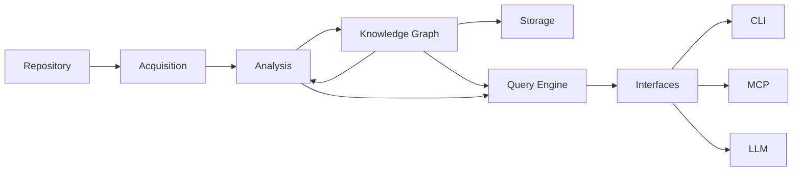

# Design

This document describes the high-level architecture of **kode**.

It explains the major subsystems, the responsibilities of each component,
and the architectural principles that guide the project.

Detailed specifications are documented separately under `docs/`.

> **Note:** This document describes the target architecture. Acquisition,
> Parsing, and Fact Extraction are implemented — see [ACQUISITION.md](docs/ACQUISITION.md),
> [ANALYSIS.md](docs/ANALYSIS.md), and [PIPELINE.md](docs/PIPELINE.md) for the
> current state. Remaining subsystems (Graph, Storage, Query, Interfaces,
> Analysis graph algorithms) are planned and follow the boundaries established
> here.

---

## Vision

kode is an evidence-first code intelligence platform.

Its purpose is to help humans and AI agents understand software projects
through deterministic analysis rather than probabilistic inference.

Instead of asking an LLM to reason directly over an entire repository,
kode builds a structured representation of the repository and uses that
representation to efficiently locate relevant source code.

Every answer is verified against the repository before it is returned.

The repository is always the source of truth.

---

## Terminology

See [GLOSSARY.md](docs/GLOSSARY.md) for definitions of all core terms used throughout this document and the project.

---

## Architecture Principles

The architecture follows a small number of non-negotiable principles.

### Repository First

Everything originates from the repository.

No repository knowledge exists without source evidence.

---

### Deterministic

Repository understanding is produced through parsers and algorithms.

LLMs never participate in repository analysis.

---

### Evidence First

Every answer should be traceable back to source code.

When evidence cannot be found,
kode should report that rather than speculate.

---

### Separation of Concerns

Every subsystem has one responsibility.

Subsystems communicate through well-defined interfaces.

---

### Incremental

Repository understanding should scale with repository changes.

Only modified files should require processing.

---

## High-Level Architecture

Repository understanding flows in one direction.

Each stage transforms information into a more useful representation.

The Knowledge Graph is the architectural center — everything before it discovers facts, everything after it consumes facts.

---

## Core Components

### Acquisition

Responsible for discovering repository structure and producing an
immutable snapshot.

The implemented scope includes:

- repository discovery orchestration
- workspace detection
- filesystem traversal
- manifest discovery
- language detection
- snapshot construction with typed inventories
- detector architecture and registries
- repository identity abstraction

The Acquisition boundary artifact is the RepositorySnapshot — an immutable
structural snapshot of the repository. Downstream processing (Parsing, Fact
Extraction) is owned by the Analysis subsystem.

See:

- docs/ACQUISITION.md
- docs/PIPELINE.md

See:

- docs/ACQUISITION.md
- docs/PIPELINE.md

---

### Knowledge Graph

The canonical representation of repository knowledge.

Every repository fact becomes a node or relationship.

Everything else consumes the graph.

See:

- docs/KNOWLEDGE_GRAPH.md

---

### Storage

Responsible for persistence.

Responsibilities include

- graph persistence
- incremental indexing
- cache management
- graph revision tracking

The storage backend is replaceable. SQLite is the default implementation.

See:

- docs/STORAGE.md

---

### Query Engine

Provides a stable interface for retrieving repository information.

Responsibilities include

- intent resolution
- graph traversal
- evidence retrieval and verification
- context assembly

See:

- docs/QUERY_ENGINE.md

---

### Analysis

Owns Parsing (Stage 2) and Fact Extraction (Stage 3) in the current
implementation.

Parsing transforms RepositorySnapshot and SourceInventory into
SyntaxTreeInventory using language-specific parsers.

Fact Extraction transforms SyntaxTreeInventory into RepositoryFacts
using language-specific extractors that produce entities with evidence.

Future responsibilities will include consuming the Knowledge Graph to
derive higher-level information:

- dependency analysis
- impact analysis
- graph algorithms
- metrics computation

Analysis never modifies the graph.

See:

- docs/ANALYSIS.md

---

### Interfaces

Expose repository knowledge to consumers.

All interfaces delegate to the Query Engine.

Examples include

- CLI
- MCP
- LLM integration

Interfaces never parse repositories directly.

Interfaces never build repository knowledge.

See:

- docs/CLI.md
- docs/MCP.md

---

## Architectural Invariants

Every implementation must preserve the following properties.

- Repository is the source of truth.
- Repository analysis is deterministic.
- Knowledge Graph is the canonical domain model.
- Every graph element has repository evidence.
- Analysis consumes the graph (read-only).
- Query Engine consumes the graph and analysis results.
- Interfaces consume the Query Engine.
- LLMs never construct repository knowledge.

Future features should extend the architecture without violating these
principles.

---

## See Also

- [Documentation index](docs/README.md) — All documents
- [ARCHITECTURE.md](docs/ARCHITECTURE.md) — High-level architecture

