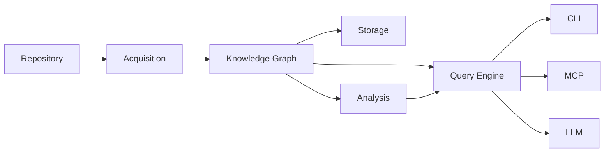
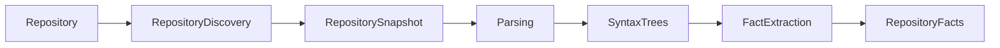

# Acquisition

This document describes the **Acquisition** subsystem, responsible for discovering repository facts and transforming source code into language-independent repository knowledge.

Acquisition is the first stage of repository understanding. It operates before any graph construction, analysis, or querying occurs.

---

## Terminology

See [GLOSSARY.md](GLOSSARY.md) for definitions of all core terms.

---

## Purpose

Acquisition exists to answer one question:

> Given a repository, what facts can be deterministically extracted from its source code?

Acquisition transforms raw source code into structured, language-independent repository facts that the Knowledge Graph can consume. It never interprets architecture, infers relationships, or constructs graph elements.

---

## Position in the Architecture



Acquisition is the only subsystem that directly touches the repository filesystem.

---

## Responsibilities

Acquisition is responsible for:

- repository discovery
- workspace discovery
- filesystem traversal
- language detection
- parser selection
- manifest discovery
- source file parsing
- syntax tree generation
- fact extraction
- evidence attachment

Acquisition is **not** responsible for:

- graph construction
- graph validation
- persistence
- analysis
- query execution
- presentation
- AI interaction

---

## Processing Stages

Acquisition operates as a three-stage pipeline.



### Stage 1 — Repository Discovery

**Purpose:** Produce a deterministic snapshot of the repository structure.

**Input:** Repository root.

**Output:** Repository Snapshot.

Repository Discovery is responsible for:

- locating the repository root
- detecting workspace boundaries
- enumerating repository files
- respecting `.gitignore`
- identifying supported languages
- locating manifests
- locating build configuration
- locating documentation
- collecting filesystem metadata

The snapshot contains only structural metadata. No source code is parsed. No repository knowledge is inferred.

### Stage 2 — Parsing

**Purpose:** Transform source files into language-specific syntax trees.

**Input:** Repository Snapshot.

**Output:** Syntax Trees.

Parsing is responsible for:

- selecting the correct parser for each file
- parsing source files
- reporting syntax errors
- preserving source locations
- exposing language-specific syntax

See [Parser Abstraction](#parser-abstraction) below for the parser architecture.

### Stage 3 — Fact Extraction

**Purpose:** Transform language-specific syntax trees into language-independent repository facts.

**Input:** Syntax Trees.

**Output:** Repository Facts.

Fact Extraction is responsible for:

- identifying repository entities
- extracting symbols
- extracting declarations
- extracting definitions
- extracting imports
- extracting exports
- extracting package information
- extracting manifests
- preserving source locations
- attaching evidence

At the end of this stage, all extracted information has a common representation regardless of programming language.

---

## Parser Abstraction

### Parser Interface

Every language parser implements a common interface:

```text
parse(SourceFile) -> SyntaxTree
```

The parser interface guarantees:

- deterministic output for identical input
- lossless syntactic preservation
- source location tracking
- error reporting without halting

### Language Plugins

Each supported language is implemented as a parser plugin. Plugins are registered and selected based on file extension or manifest metadata.

Adding a new language requires:

1. implementing the parser interface for the language
2. registering the parser with file extension or content detection
3. providing syntax tree types for the language

No changes are required elsewhere in the pipeline.

### Syntax Tree Generation

Syntax trees are language-specific. Each tree:

- represents one source file
- preserves the complete syntactic structure
- includes source locations for every node
- is lossless (no information discarded)

Syntax trees are consumed exclusively by Fact Extraction. No other subsystem accesses syntax trees directly.

### Language Independence

Fact Extraction normalizes language-specific syntax trees into a common model. Downstream subsystems (Knowledge Graph, Analysis, Query Engine) operate entirely in language-independent terms.

---

## Produced Artifacts

### Repository Snapshot

The snapshot captures repository structure without parsing source code.

Contents include:

- repository root
- workspace members
- directory hierarchy
- file inventory
- manifest locations
- language inventory

### Syntax Trees

One syntax tree per source file. Language-specific, lossless, location-tracked.

### Repository Facts

Language-independent units of knowledge.

Examples include:

- repository
- workspace
- package
- module
- file
- function
- method
- struct
- enum
- trait
- interface
- class
- variable
- constant
- macro

Every fact carries evidence (source location).

---

## Invariants

Every Acquisition implementation must satisfy:

- deterministic output
- read-only filesystem access
- no graph construction
- no repository interpretation
- evidence preservation
- language independence of produced facts

These are architectural invariants. No feature should violate them.

---

## See Also

- [DESIGN.md](../DESIGN.md) — System design and invariants
- [PIPELINE.md](PIPELINE.md) — Repository processing pipeline
- [Documentation index](README.md) — All documents
