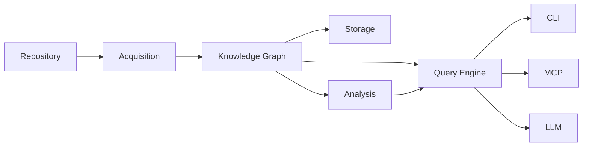

# Acquisition

This document describes the **Acquisition** subsystem, responsible for discovering repository structure and producing an immutable snapshot of its filesystem layout. Downstream processing (Parsing, Fact Extraction) is owned by the Analysis subsystem — see [ANALYSIS.md](ANALYSIS.md).

Acquisition is the first stage of repository understanding. It operates before any graph construction, analysis, or querying occurs.

---

## Terminology

See [GLOSSARY.md](GLOSSARY.md) for definitions of all core terms.

---

## Purpose

Acquisition exists to answer one question:

> Given a repository, what structural facts can be deterministically discovered from its filesystem?

Acquisition transforms a raw repository into a structured, immutable snapshot of its workspace layout, files, manifests, and languages. It never parses source code, infers relationships, or constructs graph elements.

---

## Position in the Architecture



Acquisition is the only subsystem that directly touches the repository filesystem.

---

## Responsibilities

Acquisition is responsible for:

- repository discovery
- workspace detection
- filesystem traversal
- manifest discovery
- language detection
- snapshot construction
- deterministic execution
- read-only filesystem access

Acquisition is **not** responsible for:

- source code parsing
- syntax tree generation
- fact extraction
- evidence attachment
- graph construction
- graph validation
- persistence
- analysis
- query execution
- presentation
- AI interaction

---

## Processing Stages

Acquisition consists of a single stage — Repository Discovery — which produces the Acquisition boundary artifact. Downstream stages (Parsing, Fact Extraction) are owned by the Analysis subsystem.


### Stage 1 — Repository Discovery

**Purpose:** Produce a deterministic snapshot of the repository structure.

**Input:** Repository.

**Output:** RepositorySnapshot.

Repository Discovery is an orchestration layer. It coordinates workspace detection, filesystem traversal, manifest discovery, language detection, and snapshot construction through composable detector registries.

---

#### Repository Model

Repository represents a filesystem boundary. Every repository is defined by a canonical root path that exists and is a directory.

Responsibilities:

- validate and canonicalize the repository root
- carry an optional identity assigned externally by a RepositoryIdentityService
- provide the root path for all downstream discovery operations

Repository identity is external to discovery. Discovery does not generate, assign, or manage persistent identities.

---

#### Repository Identity

RepositoryIdentityService is a service abstraction for generating repository identities:

```
RepositoryIdentityService
    generate_id(root) -> RepositoryId
```

Key properties:

- identity is generated externally and assigned to the Repository before discovery
- discovery never generates or modifies identities
- RepositoryId is an opaque identifier with no structural semantics
- the identity mechanism is replaceable without changing discovery

This separation keeps discovery focused on structural facts rather than identity management.

---

#### Discovery Orchestration

`RepositoryDiscovery` coordinates the following sequence:

1. **Workspace detection** — identify workspace structure via WorkspaceRegistry
2. **Filesystem traversal** — enumerate files and directories respecting `.gitignore`
3. **Manifest discovery** — identify build configuration and package manifests
4. **Language detection** — classify files by programming language
5. **Snapshot construction** — assemble all inventories into an immutable RepositorySnapshot

`RepositoryDiscovery` does not implement any of these steps directly. Each step delegates to a registry that composes multiple detectors.

---

#### Workspace Detection

Workspace detection identifies the workspace layout of a repository.

A Workspace describes:

- whether the repository is a single package, a multi-package workspace, or unstructured
- the root manifest location
- member packages and their manifest paths

Workspace detection is the first step because it determines which directories are relevant for traversal and which manifests to expect.

---

#### Filesystem Traversal

Filesystem traversal enumerates the repository directory tree.

Traversal:

- respects `.gitignore` rules and hidden-file conventions
- collects every file and directory relative to the repository root
- captures filesystem metadata for each file
- sorts entries deterministically

Traversal is filesystem-only. No file contents are read. No source code is parsed.

---

#### Manifest Discovery

Manifest discovery locates build configuration and package manifests.

Manifests are identified in two ways:

1. From the workspace structure — manifests declared by the workspace detector
2. From discovered files — additional manifests found during traversal

Each candidate filename is classified by the ManifestRegistry, which delegates to registered ManifestDetector implementations.

A Manifest carries:

- relative path within the repository
- manifest kind

---

#### Language Detection

Language detection classifies each discovered file by programming language.

Classification is based on the file path. Each file is evaluated by the LanguageRegistry, which delegates to registered LanguageDetector implementations.

Language is an enumerated set of known languages. Unrecognized files are not assigned a language.

---

#### Snapshot Construction

Snapshot construction assembles all collected data into a RepositorySnapshot.

The builder validates that:

- a Repository is present
- a Workspace is present

If language inventory is not explicitly provided, it is derived from the file inventory.

---

Downstream stages (Parsing, Fact Extraction) are owned by the Analysis subsystem — see [ANALYSIS.md](ANALYSIS.md).

---

## RepositorySnapshot

`RepositorySnapshot` is an immutable structural snapshot of the repository — the complete output of Stage 1.

Key properties:

- **Immutable** — once constructed, the snapshot never changes
- **Deterministic** — identical repository contents always produce identical snapshots
- **Structural only** — contains filesystem metadata, not source code
- **Self-contained** — carries all discovered inventories

Consumers:

- Analysis Parsing (Stage 2) — determines which files to parse
- CLI reporting — provides structural overview
- Downstream subsystems — establish the Acquisition boundary artifact

### Contents

| Component | Description |
|-----------|-------------|
| Repository | The canonical repository reference |
| Workspace | Workspace structure and members |
| `FileInventory` | All discovered files with metadata |
| `DirectoryInventory` | All discovered directories |
| `ManifestInventory` | Identified build manifests |
| `LanguageInventory` | Detected programming languages |

### FileInventory

`FileInventory` is an ordered collection of all discovered files.

Each file entry carries:

- relative path
- file size
- modification time
- detected language (if recognized)

`FileInventory` is the primary input for downstream processing stages.

### DirectoryInventory

`DirectoryInventory` is an ordered collection of all discovered directories.

### ManifestInventory

`ManifestInventory` is an ordered collection of discovered manifests.

Each manifest carries:

- relative path
- manifest kind

`ManifestInventory` supports path-based lookup to avoid duplicate registrations.

### LanguageInventory

`LanguageInventory` is a set of unique programming languages detected in the repository.

It is derived from `FileInventory` by collecting the distinct language assignments across all files.

---

## Detector Architecture

Detectors are the extension mechanism for Repository Discovery. Each detector type has a single responsibility and a deterministic contract.

All detectors are stateless: identical inputs always produce identical outputs.

### WorkspaceDetector

**Responsibility:** Identify workspace structure from a repository root.

**Contract:**

```
detect(root) -> Workspace | Error
```

**Behavior:**

- examines the repository root for workspace markers
- returns a Workspace describing the workspace kind and member layout
- returns a non-workspace result if no workspace is detected
- may error on malformed configuration

### ManifestDetector

**Responsibility:** Classify a filename as a known manifest type.

**Contract:**

```
detect(filename) -> ManifestKind | None
```

**Behavior:**

- examines only the filename, not the file contents or path
- returns a ManifestKind if the filename matches a known manifest pattern
- returns None for unrecognized filenames
- is purely pattern-based with no filesystem access

### LanguageDetector

**Responsibility:** Classify a file path as a known programming language.

**Contract:**

```
detect(path) -> Language | None
```

**Behavior:**

- examines the file path, typically the file extension
- returns a Language if the path matches a known language pattern
- returns None for unrecognized paths
- is purely pattern-based with no filesystem access

---

## Registries

Registries compose multiple detectors into a single detection pipeline. Each registry type implements the same contract as its corresponding detector trait with first-match semantics.

### WorkspaceRegistry

**Purpose:** Coordinate multiple WorkspaceDetector implementations.

**Behavior:**

- detectors are registered in priority order
- on detection, each detector is invoked in registration order
- the first non-None Workspace result is returned
- if no detector matches, a non-workspace result is returned
- errors propagate immediately

**Default configuration:** includes the CargoWorkspaceDetector.

### ManifestRegistry

**Purpose:** Coordinate multiple ManifestDetector implementations.

**Behavior:**

- detectors are registered in priority order
- on detection, each detector is invoked in registration order
- the first Some(ManifestKind) result is returned
- if no detector matches, None is returned

**Default configuration:** includes the CargoManifestDetector.

### LanguageRegistry

**Purpose:** Coordinate multiple LanguageDetector implementations.

**Behavior:**

- detectors are registered in priority order
- on detection, each detector is invoked in registration order
- the first Some(Language) result is returned
- if no detector matches, None is returned

**Default configuration:** includes the ExtensionLanguageDetector.

### Extension Model

Adding support for a new ecosystem or language requires:

1. implementing the appropriate detector trait
2. registering the detector with the corresponding registry
3. optionally configuring the registry with custom ordering

No changes are required to `RepositoryDiscovery` or the snapshot model.

---

## Default Implementations

The following detectors are provided as defaults. They are not architectural requirements — future ecosystems will add their own detectors following the same patterns.

### CargoWorkspaceDetector

Detects Rust Cargo workspaces and single-package repositories.

- reads `Cargo.toml` from the repository root
- identifies workspace members (literal paths and glob patterns)
- returns CargoWorkspace, SinglePackage, or no workspace

### CargoManifestDetector

Recognizes `Cargo.toml` as a Cargo manifest.

- matches the filename `Cargo.toml`

### ExtensionLanguageDetector

Classifies files by file extension.

- maps well-known extensions to Language values
- supports Rust, Python, Markdown, Toml, JSON, YAML, JavaScript, TypeScript, Go, Java, Ruby, Shell, CSS, HTML, SQL, Protobuf
- returns None for unknown extensions

---

## Discovery Sequence

```
Repository
    │
    ▼
RepositoryDiscovery
    │
    ├── WorkspaceRegistry ────────► Workspace
    │
    ├── Filesystem Traversal ─────► Files + Directories
    │
    ├── ManifestRegistry ─────────► Manifests
    │
    ├── LanguageRegistry ─────────► Language Inventory
    │
    └── SnapshotBuilder ──────────► RepositorySnapshot
```

`RepositoryDiscovery` orchestrates detection through registries. Each registry delegates to registered detectors. The SnapshotBuilder validates and assembles the final artifact.

---

Downstream stages (Parsing, Fact Extraction) are implemented in the Analysis subsystem — see [ANALYSIS.md](ANALYSIS.md).

---

## Produced Artifacts

### RepositorySnapshot

The current artifact produced by Stage 1.

Contents include:

- repository root
- workspace structure
- directory inventory
- file inventory
- manifest inventory
- language inventory

Downstream artifacts are produced by the Analysis subsystem.

See [ANALYSIS.md](ANALYSIS.md) for Syntax Tree Inventory and Repository Facts documentation.

---

## Invariants

Every Acquisition implementation must satisfy:

- deterministic output
- read-only filesystem access
- no graph construction
- no repository interpretation
- evidence preservation
- language independence of produced facts

These are architectural invariants. No feature should violate them.

---

## See Also

- [DESIGN.md](../DESIGN.md) — System design and invariants
- [PIPELINE.md](PIPELINE.md) — Repository processing pipeline
- [Documentation index](README.md) — All documents
