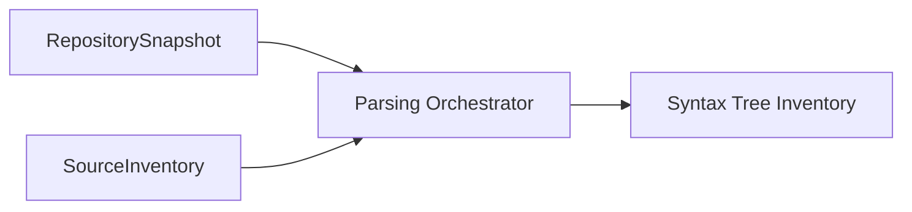
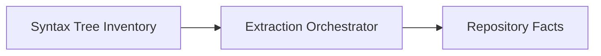

# Analysis

This document describes the **Analysis** subsystem, responsible for deriving higher-level repository knowledge from the Knowledge Graph. Analysis implements Pipeline Stage 2 (Parsing) and Stage 3 (Fact Extraction). It will later support dependency analysis, impact analysis, and other graph-based computations.

---

## Purpose

Analysis has three phases:

1. **Parsing (Stage 2)** — transforms `RepositorySnapshot` and `SourceInventory` into `SyntaxTreeInventory` by parsing source files with language-specific parsers.
2. **Fact Extraction (Stage 3)** — transforms `SyntaxTreeInventory` into `RepositoryFacts` by extracting language-independent entities with evidence.
3. **Future: Graph Analysis** — will derive higher-level repository knowledge from the persisted Knowledge Graph (dependency analysis, cycle detection, metrics, etc.).

All operations are entirely deterministic and read-only.

---

## Position in the Architecture

### Stage 2 — Parsing



Parsing is a pure transformation that consumes `RepositorySnapshot` (structural metadata produced by Acquisition Stage 1) and `SourceInventory` (immutable source text), and produces `SyntaxTreeInventory`. The orchestrator iterates files, looks up parsers via `ParserRegistry::dispatch()`, and collects outcomes.

Parsing performs no filesystem I/O — source text is loaded into `SourceInventory` before parsing begins.

### Stage 3 — Fact Extraction



Fact Extraction is a pure transformation that consumes `SyntaxTreeInventory` (parsed syntax trees from Stage 2) and produces `RepositoryFacts`. The orchestrator iterates trees, looks up extractors via `ExtractorRegistry::dispatch()`, collects all entities, and merges them into a single `RepositoryFacts`.

### Future Graph Analysis


Graph analysis will consume the persisted Knowledge Graph and produce derived facts consumed by the Query Engine.

---

## Responsibilities

### Current

**Stage 2 — Parsing:**

- selecting the correct parser via `ParserRegistry::dispatch()`
- parsing source files into abstract syntax trees
- reporting syntax errors as structured diagnostics
- preserving source locations and parser metadata
- producing an immutable `SyntaxTreeInventory`

**Stage 3 — Fact Extraction:**

- identifying repository entities from syntax trees
- extracting symbols, declarations, definitions, imports, and exports
- preserving source locations
- attaching evidence to every entity
- producing stable, deterministic entity identifiers
- producing an immutable `RepositoryFacts`

### Planned (Graph Analysis)

- dependency analysis
- impact analysis
- reachability analysis
- cycle detection
- architecture metrics
- dead code detection
- graph metrics

### Not Responsible For

- building the Knowledge Graph
- filesystem traversal (delegated to Acquisition)
- language detection (delegated to Acquisition)
- source text loading (delegated to `SourceInventory` loading)
- query execution
- presentation

---

## Parsing Architecture

The parsing subsystem (Pipeline Stage 2) transforms `RepositorySnapshot` and `SourceInventory` into `SyntaxTreeInventory`.

### Domain Model

- **SyntaxTree** — immutable artifact representing one parsed source file. Contains relative path, language, source text (shared via `Arc<str>`), structured diagnostics, parser metadata, and an internal backend handle (opaque, not exposed in public API). The backend stores the concrete syntax tree (e.g. Tree-sitter tree) but is completely hidden from external consumers.
- **FileParseOutcome** — wraps a `ParseOutcome` with the file's relative path and detected language.
- **ParseOutcome** — four-way discrimination:
  - `Success(SyntaxTree)` — clean parse
  - `Recovered(SyntaxTree)` — tree produced with syntax errors
  - `Skipped(SkipReason)` — language has no registered parser
  - `Failed(Vec<Diagnostic>)` — parse error
- **SyntaxTreeInventory** — immutable ordered collection of `FileParseOutcome` entries. Indexed by file path (`HashMap`) for O(1) lookup while preserving deterministic insertion order.
- **SourceInventory** — immutable source text storage. Maps relative paths to `Arc<str>`. Constructed before parsing begins, either from the filesystem (`SourceInventory::from_snapshot`) or programmatically (`SourceInventory::new`).
- **Diagnostic** — structured error/warning with severity, message, and source location (line/column range).
- **SkipReason** — currently `UnsupportedLanguage`; may be extended for empty files, binary files, etc.

### Parser Trait

The `Parser` trait is the extension point for adding language support:

```rust
pub trait Parser: Debug {
    fn language(&self) -> Language;
    fn parse(&self, source: Arc<str>, file: &RepositoryFile) -> ParseOutcome;
}
```

- `language()` — the programming language this parser handles
- `parse()` — parses source text (as `Arc<str>`) and returns a `ParseOutcome`

Note: `can_parse()` has been removed. Parser selection is performed by `ParserRegistry::dispatch()` based on direct language comparison, not by querying each parser.

### ParserRegistry

Follows the same registry pattern as Acquisition (LanguageRegistry, ManifestRegistry, WorkspaceRegistry):

- `new()` — empty registry
- `register(Box<dyn Parser>)` — add a parser
- `dispatch(&Language)` — find first parser matching the language (O(n) linear scan, deterministic registration order)
- `iter()` — iterate registered parsers

`ParserRegistry` is a **dispatcher**, not a parser. It no longer implements the `Parser` trait.

Default registry includes `RustParser`.

### Registration Example

```rust
let mut registry = ParserRegistry::new();
registry.register(Box::new(RustParser));
// Future: registry.register(Box::new(PythonParser));
```

### Tree-sitter Integration

Tree-sitter is fully encapsulated behind a `pub(crate)` adapter module (`ts.rs`). No Tree-sitter types appear in the public API:

- `SyntaxTree::tree()` has been removed — consumers cannot access the raw Tree-sitter tree
- The internal `SyntaxBackend` type stores the tree as an `Arc<tree_sitter::Tree>` and is only accessible within the crate via `pub(crate) fn backend()`
- The adapter handles:
  - parser creation and language grammar registration
  - parse execution
  - diagnostics extraction (walking ERROR and MISSING nodes)

### SyntaxTree Inventory

`SyntaxTreeInventory` provides deterministic iteration (in snapshot file order) and O(1) lookup by relative path via an internal `HashMap<PathBuf, usize>` index.

### SourceInventory

`SourceInventory` is the single owner of source text content. It is constructed before parsing and is an immutable input to the orchestrator:

```rust
let sources = SourceInventory::from_snapshot(&snapshot)?;
let inventory = orchestrator.run(&snapshot, &sources);
```

Source text is stored as `Arc<str>` to enable zero-copy sharing with `SyntaxTree` entries.

---

## Fact Extraction Architecture (Stage 3)

Fact Extraction (Pipeline Stage 3) transforms `SyntaxTreeInventory` into `RepositoryFacts`.

### Position in the Pipeline


Fact Extraction is a pure transformation that consumes `SyntaxTreeInventory` (parsed syntax trees from Stage 2) and produces `RepositoryFacts`. The orchestrator iterates trees, looks up extractors via `ExtractorRegistry::dispatch()`, collects all entities, and merges them into a single `RepositoryFacts`.

### Domain Model

- **RepositoryFacts** — immutable, complete extracted semantic model for a repository. Owns all extracted entities with deterministic ordering (sorted by `EntityId`) and evidence attached to every entity.
- **EntityId** — stable, deterministic identifier for every entity. Generated by hashing (language, kind, file path, name, byte offset). Reproducible across independent runs.
- **Evidence** — source location evidence attached to every entity. Contains source file, node kind, byte range, line/column range, and language.
- **Entity** — discriminated enum wrapping all fact types (Module, Function, Struct, Enum, Trait, ImplBlock, TypeAlias, Constant, Static, Import, Export).
- **ExtractionOutcome** — per-tree outcome: Success, Partial (with diagnostics), Skipped, Failed.

### Entity Types

| Entity | Fields | Description |
|--------|--------|-------------|
| `ModuleFact` | name, visibility, evidence | Module declarations |
| `FunctionFact` | name, visibility, signature, generics, async/const/unsafe flags, documentation, containing trait/impl | Functions and methods |
| `StructFact` | name, fields (with types and visibility), generics, evidence | Struct definitions |
| `EnumFact` | name, variants (with discriminants), visibility, evidence | Enum definitions |
| `TraitFact` | name, visibility, method IDs, associated type IDs, constant IDs, evidence | Trait definitions |
| `ImplBlockFact` | target type, implemented trait, method IDs, evidence | Implementation blocks |
| `TypeAliasFact` | name, aliased type, evidence | Type aliases |
| `ConstantFact` | name, type, value, evidence | Const declarations |
| `StaticFact` | name, type, mutability, evidence | Static declarations |
| `ImportFact` | path, alias, glob flag, evidence | Use declarations |
| `ExportFact` | path, alias, re-export flag, evidence | Pub use declarations |

### Extractor Trait

The `Extractor` trait is the extension point for adding language fact extraction:

```rust
pub trait Extractor: Debug {
    fn language(&self) -> Language;
    fn extract(&self, tree: &SyntaxTree) -> ExtractionOutcome;
}
```

- `language()` — the programming language this extractor handles
- `extract()` — walks the syntax tree, extracts entities with evidence, reports diagnostics

### ExtractorRegistry

Follows the same registry pattern as Parsing:

- `new()` — empty registry
- `register(Box<dyn Extractor>)` — add an extractor
- `dispatch(&Language)` — find first extractor matching the language (O(n) linear scan)
- `iter()` — iterate registered extractors

Default registry includes `RustExtractor`.

### ExtractionOrchestrator

`ExtractionOrchestrator` drives the pipeline:

1. Receives `&SyntaxTreeInventory`
2. Iterates parsed syntax trees (deterministic order)
3. For each tree, selects extractor via `ExtractorRegistry::dispatch()`
4. Executes extractor, collects entities and diagnostics
5. Merges all entities into `RepositoryFacts` (sorted by `EntityId`)

### RustExtractor

The `RustExtractor` walks the Tree-sitter syntax tree and extracts:
- Top-level declarations (functions, structs, enums, traits, impls, type aliases, constants, statics, modules, use declarations)
- Nested declarations (enum variants, struct fields, trait methods/associated types/associated constants, impl methods)
- Visibility modifiers (pub, pub(crate), pub(super), pub(in path))
- Function modifiers (async, const, unsafe)
- Generic type parameters
- Doc comments (///, /** */)
- Function signatures

Every extracted entity includes:
- A stable `EntityId`
- `Evidence` with source file, node kind, byte range, line/column, and language

### Evidence Guarantees

- Every entity has a valid `Evidence` reference.
- Evidence includes source file, syntax node kind, byte range, line/column positions, and language.
- Evidence supports tracing any extracted entity back to its source location.
- Evidence is immutable after construction.

### Deterministic Behavior

- Entity IDs are content-derived (hash of language, kind, path, name, byte offset) — independent of traversal order.
- `RepositoryFacts` sorts entities by `EntityId` for deterministic iteration order.
- The same source code always produces the same entities with the same IDs.
- The orchestrator iterates trees in the inventory's deterministic order.

### Adding a New Language Extractor

1. Create a struct for the extractor (e.g., `PythonExtractor`)
2. Implement the `Extractor` trait with `language()` and `extract()`
3. Walk the syntax tree in `extract()` to find declarations
4. Create entities with `Evidence` and `EntityId`
5. Register the extractor in an `ExtractorRegistry`

No changes to the orchestrator, model types, or other extractors are required.

### Failure Modes

- Individual tree extraction failures never abort the entire run.
- Unsupported languages are skipped with a diagnostic.
- Trees with parse errors are still extracted (recoverable), with warnings.
- Extraction failures produce diagnostics without aborting.

### Parser Metadata

Each `SyntaxTree` stores metadata for provenance and debugging:
- `parser_name` — human-readable parser identifier (e.g. "tree-sitter-rust")
- `parser_version` — optional parser library version
- `grammar_version` — optional grammar version
- `backend_id` — backend identifier (e.g. "tree-sitter")

### Orchestrator

`ParsingOrchestrator` drives the pipeline:

1. Receives `&RepositorySnapshot` and `&SourceInventory`
2. Iterates files in snapshot order (deterministic)
3. For each file with a detected language:
   - Looks up source text in `SourceInventory`
   - Selects parser via `ParserRegistry::dispatch()`
   - Executes parser with `Arc::clone(source_arc)`
4. Collects outcomes into `SyntaxTreeInventory`

No filesystem I/O occurs during orchestration — source text is loaded into `SourceInventory` beforehand.

### Adding a New Language Parser

1. Create a struct for the parser (e.g., `PythonParser`)
2. Implement the `Parser` trait with `language()` and `parse()`
3. In the `parse()` method, use the internal tree-sitter adapter or another backend
4. Register the parser in a `ParserRegistry`

No changes to the orchestrator, inventory types, or other parsers are required.

---

## Core Concepts (Planned)

### Dependency Analysis

Computes dependency relationships between repository entities. Output includes dependency trees and dependency graphs at various granularities (file, module, package, workspace).

### Impact Analysis

Determines what would be affected by a change to a given entity. Impact is computed by traversing dependency relationships in the reverse direction — finding all entities that depend on the target.

### Reachability

Determines whether a path exists between two entities in the graph. Supports both directed and undirected reachability queries.

### Cycle Detection

Identifies circular dependencies in the graph. Cycles are reported as strongly connected components (SCCs) with full membership lists.

### Architecture Metrics

Computes quantitative measures of repository structure:

- fan-in (how many entities depend on this entity)
- fan-out (how many entities this entity depends on)
- module cohesion
- layer violation detection
- instability metrics

### Dead Code Analysis

Identifies entities that are defined but never referenced by any other entity in the repository. Results are reported with supporting evidence so they can be verified manually.

---

## Relationship with Query Engine

Analysis and the Query Engine serve complementary roles:

| Aspect | Analysis | Query Engine |
|--------|----------|--------------|
| Input | Persisted Knowledge Graph | Knowledge Graph + Analysis results |
| Output | Derived facts | Evidence-backed answers |
| Focus | What the repository means | What the user asked |
| Access | Read-only | Read-only |
| Consumer | Query Engine | Interfaces (CLI, MCP, LLM) |

Analysis computes derived facts (dependency cycles, metrics). The Query Engine uses those facts alongside direct graph traversal to answer user questions.

---

## Inputs

- Graph Revision (the persisted Knowledge Graph)

---

## Outputs

Derived Facts. Examples include:

- dependency trees
- dependency cycles
- strongly connected components
- fan-in metrics
- fan-out metrics
- architecture summaries
- repository statistics
- impact reports

Every derived fact remains evidence-backed. Each result must be traceable to the graph elements that produced it.

---

## Graph Algorithms

Analysis uses deterministic graph algorithms including:

- breadth-first search (BFS)
- depth-first search (DFS)
- topological sorting
- Tarjan's algorithm (SCC detection)
- shortest path (Dijkstra / BFS for unweighted)
- reachability matrix
- transitive closure

Algorithms never modify graph state.

---

## Extension Points

Analysis supports extension through:

- new graph algorithms
- new metric computations
- new analysis types
- new output formats

---

## Design Constraints

Every Analysis implementation must satisfy:

- deterministic execution
- read-only access to the Knowledge Graph
- reproducible results
- evidence preservation in all derived facts
- no repository knowledge creation

These constraints are architectural invariants. Analysis must never introduce knowledge unsupported by the graph.

---

## See Also

- [DESIGN.md](../DESIGN.md) — System design
- [Documentation index](README.md) — All documents
