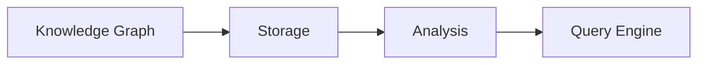

# Analysis

This document describes the **Analysis** subsystem, responsible for deriving higher-level repository knowledge from the persisted Knowledge Graph.

---

## Purpose

Analysis exists to answer architectural questions about the repository that go beyond individual symbols and relationships. While the Knowledge Graph captures what exists, Analysis computes what it means.

Analysis is entirely deterministic. It never uses AI. It never modifies the Knowledge Graph.

---

## Position in the Architecture

Analysis consumes the persisted Knowledge Graph and produces derived facts consumed by the Query Engine.

---

## Responsibilities

Analysis is responsible for:

- dependency analysis
- impact analysis
- reachability analysis
- cycle detection
- architecture metrics
- dead code detection
- graph metrics

Analysis is **not** responsible for:

- building the Knowledge Graph
- parsing source code
- query execution
- presentation

---

## Core Concepts

### Dependency Analysis

Computes dependency relationships between repository entities. Output includes dependency trees and dependency graphs at various granularities (file, module, package, workspace).

### Impact Analysis

Determines what would be affected by a change to a given entity. Impact is computed by traversing dependency relationships in the reverse direction — finding all entities that depend on the target.

### Reachability

Determines whether a path exists between two entities in the graph. Supports both directed and undirected reachability queries.

### Cycle Detection

Identifies circular dependencies in the graph. Cycles are reported as strongly connected components (SCCs) with full membership lists.

### Architecture Metrics

Computes quantitative measures of repository structure:

- fan-in (how many entities depend on this entity)
- fan-out (how many entities this entity depends on)
- module cohesion
- layer violation detection
- instability metrics

### Dead Code Analysis

Identifies entities that are defined but never referenced by any other entity in the repository. Results are reported with supporting evidence so they can be verified manually.

---

## Relationship with Query Engine

Analysis and the Query Engine serve complementary roles:

| Aspect | Analysis | Query Engine |
|--------|----------|--------------|
| Input | Persisted Knowledge Graph | Knowledge Graph + Analysis results |
| Output | Derived facts | Evidence-backed answers |
| Focus | What the repository means | What the user asked |
| Access | Read-only | Read-only |
| Consumer | Query Engine | Interfaces (CLI, MCP, LLM) |

Analysis computes derived facts (dependency cycles, metrics). The Query Engine uses those facts alongside direct graph traversal to answer user questions.

---

## Inputs

- Graph Revision (the persisted Knowledge Graph)

---

## Outputs

Derived Facts. Examples include:

- dependency trees
- dependency cycles
- strongly connected components
- fan-in metrics
- fan-out metrics
- architecture summaries
- repository statistics
- impact reports

Every derived fact remains evidence-backed. Each result must be traceable to the graph elements that produced it.

---

## Graph Algorithms

Analysis uses deterministic graph algorithms including:

- breadth-first search (BFS)
- depth-first search (DFS)
- topological sorting
- Tarjan's algorithm (SCC detection)
- shortest path (Dijkstra / BFS for unweighted)
- reachability matrix
- transitive closure

Algorithms never modify graph state.

---

## Extension Points

Analysis supports extension through:

- new graph algorithms
- new metric computations
- new analysis types
- new output formats

---

## Design Constraints

Every Analysis implementation must satisfy:

- deterministic execution
- read-only access to the Knowledge Graph
- reproducible results
- evidence preservation in all derived facts
- no repository knowledge creation

These constraints are architectural invariants. Analysis must never introduce knowledge unsupported by the graph.

---

## See Also

- [DESIGN.md](../DESIGN.md) — System design
- [Documentation index](README.md) — All documents
