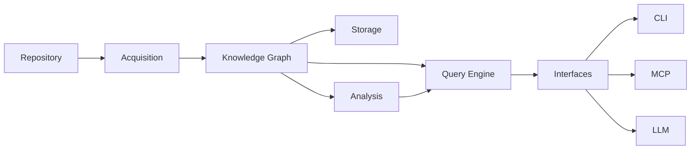
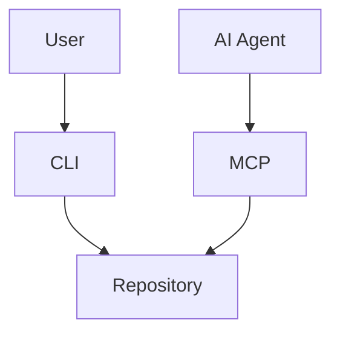
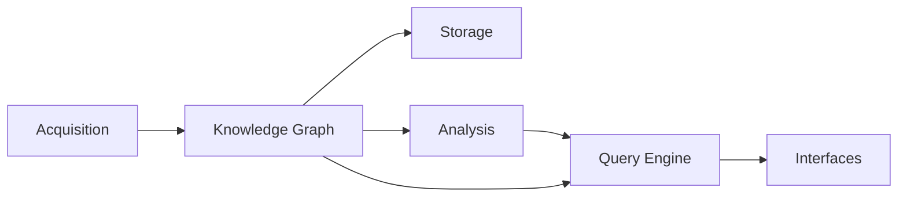
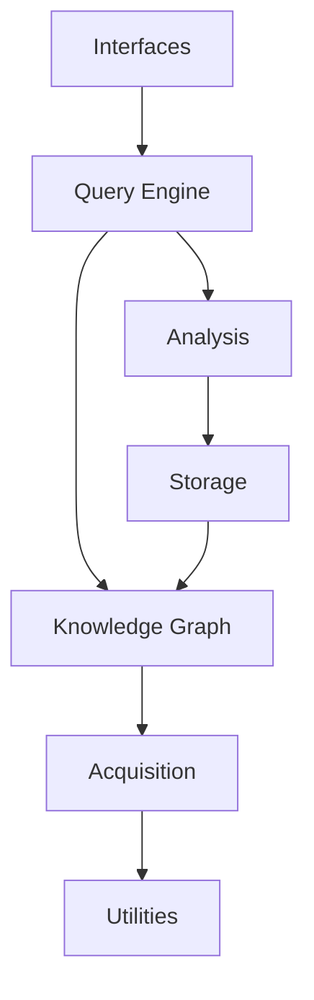
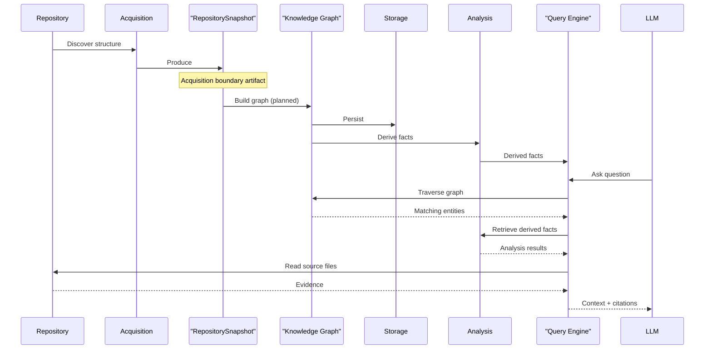

# Architecture

This document describes the high-level architecture of **kode**.

It explains how the major subsystems interact, the responsibilities of each
component, and the architectural boundaries between them.

Detailed specifications for each subsystem are documented separately.

---

## Terminology

See [GLOSSARY.md](GLOSSARY.md) for definitions of all core terms.

---

## Overview

kode is organized as a deterministic pipeline centered around a
Knowledge Graph.

Every subsystem either:

- contributes information to the Knowledge Graph, or
- consumes information from it.

The graph is the architectural center of the system.

Each stage has a single responsibility.

Information flows in one direction.

---

## Architectural Principles

The architecture follows several fundamental principles defined in [DESIGN.md](../DESIGN.md#architecture-principles) — Repository First, Deterministic, Evidence First, Separation of Concerns, and Incremental processing.

These principles are documented fully in DESIGN.md. All subsystems inherit them.

---

## System Context

Both humans and AI agents interact with the same repository model.

There are no separate execution paths.

---

## Component Overview

---

## Acquisition Layer

Responsible for discovering repository structure and producing an
immutable snapshot.

Responsibilities include

- repository discovery
- workspace detection
- filesystem traversal
- manifest discovery
- language detection
- snapshot construction

The Acquisition boundary artifact is the **RepositorySnapshot** — an
immutable structural snapshot of the repository. Parsing and fact
extraction are planned but not yet implemented.

Output:

RepositorySnapshot (current). Repository facts (planned).

See:

- ACQUISITION.md
- PIPELINE.md

---

## Knowledge Graph Layer

Responsible for representing repository knowledge.

Responsibilities include

- graph construction
- node management
- relationship management
- graph validation
- graph queries (low-level traversal)

The graph is immutable once constructed.

See:

- KNOWLEDGE_GRAPH.md

---

## Storage Layer

Responsible for persistence.

Responsibilities include

- graph persistence
- cache management
- graph revisions
- incremental indexing

Storage never performs analysis.

See:

- STORAGE.md

---

## Analysis Layer

Responsible for deriving information from the graph.

Examples include

- dependency analysis
- impact analysis
- cycle detection
- architecture metrics
- dead code detection

Analysis consumes the graph.

It never modifies repository knowledge.

See:

- ANALYSIS.md

---

## Query Engine

Transforms repository knowledge into evidence-backed answers.

Responsibilities include

- intent resolution
- graph traversal
- evidence retrieval and verification
- context assembly

The Query Engine consumes the Knowledge Graph for traversal and Analysis results for derived facts. It never builds repository knowledge.

Consumers should never manipulate graph internals directly.

See:

- QUERY_ENGINE.md

---

## Interface Layer

Interfaces expose functionality to external consumers.

Examples include

- CLI
- MCP
- future HTTP API
- future IDE integrations

Interfaces never perform parsing.

Interfaces never build repository knowledge.

They consume existing graph data.

---

## Layer Dependencies

Dependencies always flow downward.

Circular dependencies are prohibited.

---

## Data Flow

Repository processing follows a deterministic lifecycle.

The graph accelerates discovery (see [QUERY_ENGINE.md](QUERY_ENGINE.md)). The repository provides verification.

---

## Extension Points

The architecture intentionally supports extension.

Examples include

- new language parsers
- new manifest formats
- new graph algorithms
- new exporters
- new storage backends
- new interface adapters

These extensions should not require architectural changes.

---

## Future Interfaces

The current interfaces are

- CLI
- MCP

Future interfaces may include

- Language Server Protocol (LSP)
- VS Code extension
- JetBrains plugin
- Web UI
- GraphQL API

These interfaces will consume the same Query Engine.

---

## Architectural Invariants

The architectural invariants defined in [DESIGN.md](../DESIGN.md#architectural-invariants) apply to all subsystems. Every implementation must preserve them.

---

## See Also

- [DESIGN.md](../DESIGN.md) — System design and invariants
- [Documentation index](README.md) — All documents

