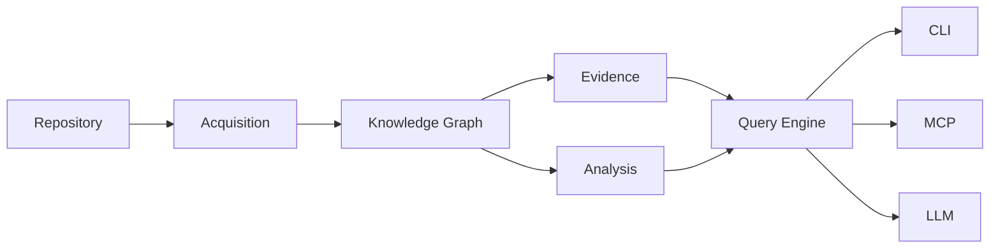
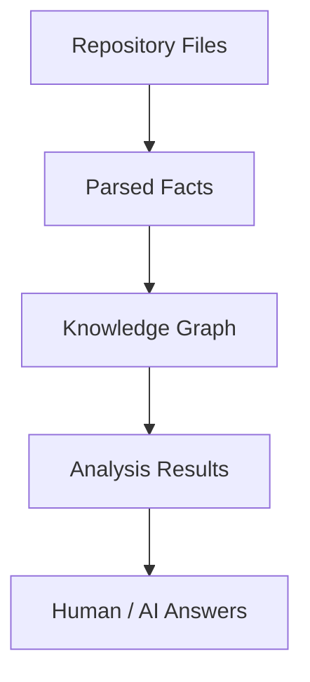
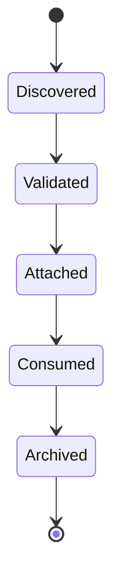
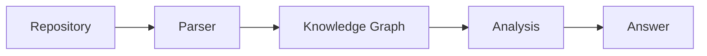
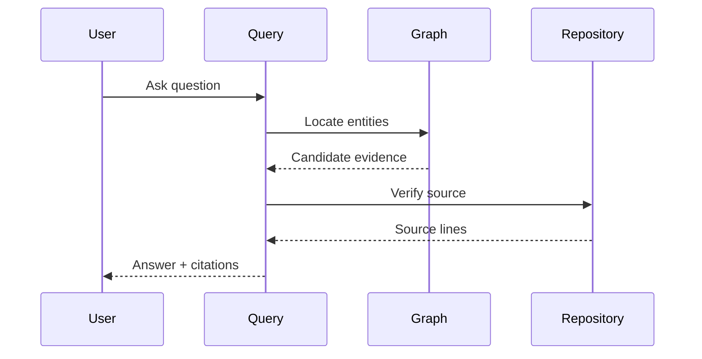
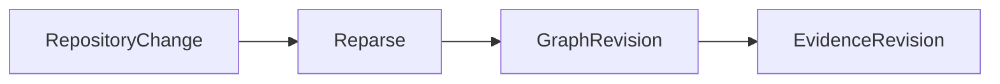

# Evidence Model

This document defines the evidence model used throughout **kode**.

Evidence is the foundation of repository understanding.

Every repository fact, graph element, analysis result, and AI-generated answer
must ultimately be supported by evidence from the repository.

Evidence is not a confidence score.

Evidence is verifiable.

---

## Terminology

See [GLOSSARY.md](GLOSSARY.md) for definitions of all core terms.

---

## Purpose

The evidence model exists to answer one question:

> How does kode know that a statement about a repository is true?

Unlike systems that rely on statistical confidence or semantic similarity,
kode requires every factual statement to be traceable to repository artifacts.

If evidence cannot be established, kode should report that the answer is
unknown rather than speculate.

---

## Position in the Architecture



Evidence is produced during repository analysis and consumed whenever
repository information is presented.

Every consumer shares the same evidence model.

---

## Design Principles

The evidence model follows the architectural principles defined in [DESIGN.md](../DESIGN.md#architecture-principles). See those principles for the canonical definitions.

---

## Sources of Evidence

Evidence may originate from multiple repository artifacts.

Examples include:

* source files
* manifest files
* configuration files
* documentation
* build files
* test files

Future versions may include additional repository-derived sources.

External services are not considered repository evidence.

---

## Evidence Hierarchy

Not all evidence has the same level of authority.



Authority always flows downward.

Every higher layer must remain traceable to lower layers.

---

## Evidence Lifecycle



Evidence is discovered once and reused many times.

---

## Evidence Granularity

Evidence should be as precise as practical.

Preferred evidence includes:

* file
* line
* column
* symbol
* span

Example:

```text
src/auth/login.rs:42-57
```

More precise evidence is preferred over broader references.

---

## Evidence Types

Evidence may support different kinds of facts.

### Structural Evidence

Supports repository structure.

Examples:

* module declarations
* symbol definitions
* package layouts

---

### Behavioral Evidence

Supports relationships.

Examples:

* function calls
* imports
* implementations
* inheritance

---

### Configuration Evidence

Supports runtime configuration.

Examples:

* Cargo.toml
* package.json
* Dockerfile
* configuration files

---

### Documentation Evidence

Supports human-written documentation.

Examples:

* README
* architecture documentation
* inline comments

Documentation should never override executable source code.

---

## Evidence Chain

Every derived fact should preserve its origin.



The complete chain should remain inspectable.

---

## Evidence Attachment

Evidence may be attached to:

* graph nodes
* graph relationships
* analysis results
* query results
* generated answers

No repository fact should exist without supporting evidence.

---

## Evidence Resolution

When answering a question, kode resolves evidence before producing an answer.



The repository is consulted again before presenting evidence.

The graph accelerates discovery.

The repository confirms correctness.

---

## Citation Model

Evidence should be presented in a consistent format.

Preferred citation:

```text
path/to/file.rs:42
```

Ranges may be used where appropriate.

```text
src/lib.rs:18-34
```

Multiple citations may support a single statement.

---

## Derived Facts

Some repository facts are computed rather than directly parsed.

Examples include:

* dependency cycles
* shortest paths
* impact analysis
* architecture summaries

Derived Facts remain evidence-backed.

The supporting evidence is the set of graph elements used during computation.

---

## Missing Evidence

If evidence cannot be established, kode must not fabricate facts.

Possible responses include:

* unknown
* not found
* insufficient evidence

Lack of evidence should never be replaced with speculation.

---

## Conflicting Evidence

Repository artifacts may occasionally conflict.

Preferred precedence:

1. Source code
2. Build configuration
3. Tests
4. Documentation
5. Generated artifacts

Executable source code always takes precedence over documentation.

---

## Evidence Revisions

Evidence belongs to a specific repository state.

Repository changes invalidate affected evidence.



Evidence from different revisions should never be mixed.

---

## Consumer Responsibilities

All consumers must preserve evidence.

Consumers include:

* CLI
* MCP
* LLM
* future APIs

Consumers may transform presentation.

Consumers must never alter evidence.

---

## LLM Contract

The LLM is a consumer of evidence.

The LLM may:

* summarize
* explain
* compare
* organize

The LLM must not:

* invent repository facts
* create citations
* modify evidence
* ignore conflicting evidence

If the available evidence is insufficient, the LLM should explicitly state
that the repository does not provide enough information.

---

## Future Extensions

The evidence model is expected to evolve.

Future evidence sources may include:

* Git history
* code ownership
* coverage reports
* CI results
* static analysis
* security scans

These remain evidence only when they are derived from or associated with the
repository.

---

## Design Constraints

Every implementation of the evidence model must satisfy the following
constraints.

* Repository-backed
* Deterministic
* Verifiable
* Traceable
* Immutable
* Revision-aware
* Consumer-independent
* Presentation-independent

These constraints are architectural invariants.

Evidence is the foundation of trust in kode.

Without evidence, repository knowledge does not exist.

---

## See Also

- [DESIGN.md](../DESIGN.md) — System design and invariants
- [Documentation index](README.md) — All documents

