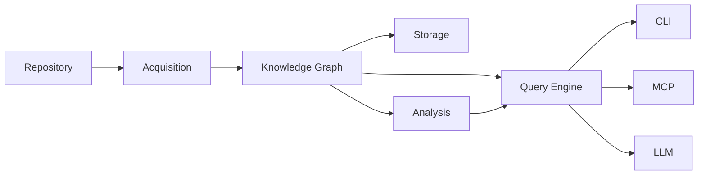
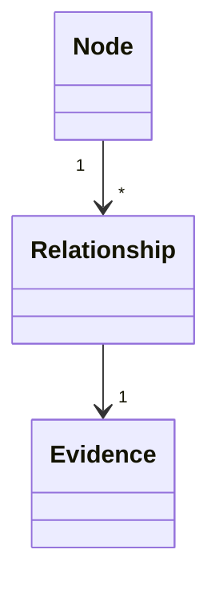
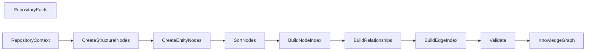
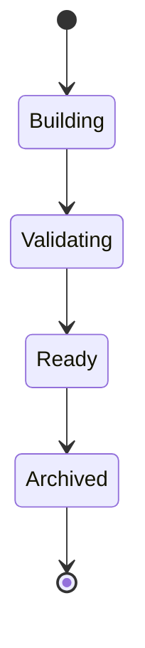
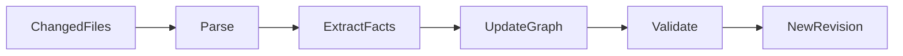

# Knowledge Graph

This document specifies the **Knowledge Graph**, the canonical representation
of repository knowledge within **kode**.

The Knowledge Graph is the central domain model of the system.

It provides a deterministic, structured, and language-independent view of a
repository that enables efficient querying, analysis, and evidence-backed
reasoning.

The Knowledge Graph is an implementation detail. Users interact with CLI,
MCP, and AI agents—not the graph directly.

---

## Terminology

See [GLOSSARY.md](GLOSSARY.md) for definitions of all core terms.

---

## Purpose

The Knowledge Graph exists to answer one question efficiently:

> Given a repository, how can its structure and relationships be represented in
> a deterministic form?

Rather than repeatedly traversing the filesystem or reparsing source code,
kode constructs a reusable graph that captures repository entities and their
relationships.

The graph is designed to be:

* deterministic
* immutable
* incrementally updateable
* language independent
* evidence-backed
* queryable

---

## Position in the Architecture

The Knowledge Graph sits at the center of the architecture.

Everything before the graph discovers facts.

Everything after the graph consumes facts.

---

## Responsibilities

The Knowledge Graph is responsible for:

- representing repository entities
- representing deterministic relationships
- preserving evidence
- exposing graph traversal APIs
- supporting graph queries (low-level traversal)
- remaining language independent

The graph is **not** responsible for:

- filesystem traversal
- parsing source code
- persistence
- AI reasoning
- report generation
- visualization

Those responsibilities belong to other subsystems.

---

## Implementation Status

The Knowledge Graph is fully implemented as Stage 4 of the pipeline.

The implementation lives in the `kode-graph` crate (`crates/graph/`).

---

## Core Concepts

The graph consists of three fundamental concepts.

* Nodes
* Relationships
* Evidence

Everything in the graph ultimately reduces to these concepts.

---

## Nodes

A node represents an entity within the repository.

Nodes describe **things**, not actions.

Two categories exist:

### Structural Nodes

Synthetic graph nodes created by the graph builder to organize the hierarchy:

* **Repository** — the repository root
* **Workspace** — a workspace within the repository
* **File** — a source file containing extracted entities

Structural nodes use [`StructuralNodeKind`] to identify their type
(an enum with `Repository`, `Workspace`, `File` variants—never a
bare string). They use [`GraphNodeId::Structural`] with
[`StructuralNodeId`] as their identity, and carry
[`GraphEvidence::Structural`].

### Entity Nodes

Nodes created from extracted facts. Each extracted fact becomes one node:

* Module
* Function
* Struct
* Enum
* Trait
* ImplBlock
* TypeAlias
* Constant
* Static
* Import
* Export

Entity nodes use [`GraphNodeId::Entity`] wrapping the existing
[`EntityId`], and carry [`GraphEvidence::Source`] with the original
parser-produced evidence.

Every node has a unique identity.

---

## Node Identity

Every node is assigned a stable identifier.

| Node Category | Identity Type | Construction |
|---------------|---------------|-------------|
| Structural | `GraphNodeId::Structural(StructuralNodeId)` | Hash of (`StructuralNodeKind`, path, name) in a separate namespace |
| Entity | `GraphNodeId::Entity(EntityId)` | Hash of (language, kind, path, name, byte_offset) |

Structural and entity identities cannot collide — they use separate hash
namespaces.

Stable identities allow:

* incremental updates
* efficient caching
* graph diffing
* external references

Node identifiers remain stable whenever repository changes permit.

---

## Node Metadata

Each node carries metadata appropriate for its kind.

Common metadata includes:

* identifier
* node kind
* display name
* visibility
* source documentation

Structural nodes carry minimal metadata (no visibility, no documentation).

---

## Relationships

Relationships connect nodes.

Every relationship has:

* source node
* destination node
* relationship type
* evidence

Relationships are directed.

### Relationship Types

| Type | Source | Target | Description |
|------|--------|--------|-------------|
| `Contains` | Repository | Workspace | Structural containment |
| `Contains` | Workspace | File | Structural containment |
| `Declares` | File | Entity | A file declares an extracted entity |
| `Defines` | Trait/ImplBlock | Function | An entity defines a sub-entity |

Relationship meanings never overlap.

Each relationship type has a single semantic interpretation.

---

## Evidence

Evidence is a first-class concept.

Every node and every relationship must be backed by repository evidence.

Two evidence kinds exist:

| Evidence Kind | Used By | Content |
|---------------|---------|---------|
| `GraphEvidence::Source(Evidence)` | Entity nodes, declares/defines relationships | Parser-produced source location (file, byte range, line/column, language) |
| `GraphEvidence::Structural(StructuralEvidence)` | Structural nodes, contains relationships | Structured metadata: repository root, workspace name, or file path |

`StructuralEvidence` is a typed enum with three variants:

| Variant | Fields | Used For |
|---------|--------|----------|
| `Repository` | `root: PathBuf` | Repository node, contains relationships from repository |
| `Workspace` | `name: String` | Workspace node, contains relationships from workspace |
| `File` | `path: PathBuf` | File node |

The human-readable description is derived from the structured variant,
not stored as a free-form string.

Evidence is never inferred by an LLM.

If evidence cannot be established, the graph element must not exist.

---

## Graph Construction

Graph construction follows a deterministic sequence implemented by
[`GraphBuilder`].

The builder is decomposed into focused sub-modules:

| Module | Responsibility |
|---------|---------------|
| `builder/mod.rs` | Orchestration — coordinates the build pipeline via [`GraphBuildState`] |
| `builder/context.rs` | [`RepositoryContext`] — sole owner of temporary repository metadata derivation (replaced by Acquisition in Stage 5). **External** to the builder. |
| `builder/structural.rs` | Structural nodes (repository, workspace, file) — consumes context only; returns [`StructuralLookup`] |
| `builder/node_builder.rs` | Entity nodes (one per extracted fact) |
| `builder/relationship_builder.rs` | Relationship derivation — consumes [`StructuralLookup`], never hashes structural IDs independently |
| `builder/identity.rs` | Graph-level identity and evidence construction |
| `builder/index.rs` | Lookup and edge index structures |

Each stage has a single responsibility.

Graph construction never performs interpretation.

### Ownership Boundaries

* [`RepositoryContext`] is constructed **externally** and passed into
  [`GraphBuilder::build`].
* [`GraphBuilder`] performs **zero repository discovery** — it only
  consumes metadata.
* Structural IDs are generated **exactly once** by `structural` and
  cached in [`StructuralLookup`]. [`RelationshipBuilder`] references
  existing IDs rather than recomputing them.
* [`GraphBuildState`] accumulates all builder state during construction,
  replacing independent vectors and maps.

---

## Graph Validation

Before becoming available, every graph is validated by [`GraphValidator`].

Validation ensures:

* Exactly one repository node exists
* Exactly one workspace node exists
* No duplicate node IDs (safety net — builder guarantees uniqueness)
* Relationship endpoints refer to existing nodes
* Structural nodes have structural identity and structural evidence
* Entity nodes have entity identity and source evidence

Evidence completeness is enforced at the type level — structurally invalid
combinations cannot be constructed even in release builds.
[`Node::structural`] and [`Node::entity`] accept concrete inner types
that guarantee the correct identity/evidence pairing.
[`Relationship::structural`] and [`Relationship::with_source`] provide
the same guarantee for edges.

Invalid graphs are rejected.

---

## Lifecycle

### Graph Lifecycle

The graph is immutable after construction.

Repository changes never mutate an existing graph.

Instead, a new graph revision is produced.

This guarantees deterministic behavior and thread safety.

---

## Graph Queries

Consumers interact with the graph through the public API.

Available operations:

| Method | Complexity | Description |
|--------|-----------|-------------|
| `node_by_id(id)` | O(log n) | Look up a node by [`GraphNodeId`] |
| `nodes()` | O(1) | All nodes in deterministic order |
| `relationships()` | O(1) | All relationships in deterministic order |
| `node_count()` | O(1) | Number of nodes |
| `relationship_count()` | O(1) | Number of relationships |
| `nodes_by_kind(kind)` | O(n) | Filter nodes by [`NodeKind`] |
| `outgoing(id)` | O(1) amortized | Relationships from a node |
| `incoming(id)` | O(1) amortized | Relationships to a node |

Higher-level query operations (intent resolution, context assembly) belong to the Query Engine.

Consumers never manipulate graph internals directly.

---

## Graph Traversal

Traversal replaces repeated filesystem searches.

The graph narrows the search space.

Source files remain the final authority.

---

## Graph Algorithms

The graph supports low-level traversal primitives used by the Analysis and Query Engine subsystems.

Higher-level algorithms (dependency analysis, cycle detection, metrics) belong to the Analysis layer.

Algorithms never modify graph state.

---

## Incremental Updates

Repository changes should not require rebuilding the entire graph.

Only affected entities are recomputed.

Unchanged regions are preserved.

---

## Serialization

The graph is independent of persistence.

Possible serialization formats include:

* SQLite
* JSON
* GraphML
* DOT

Serialization is an adapter.

It is never the canonical representation.

---

## Extension Points

The graph is intentionally extensible.

Future node types may include:

* Git commits
* Code ownership
* Runtime traces
* Test coverage
* Security findings
* Performance profiles

Future relationship types may include:

* owns
* generated_by
* executes
* observes
* deploys

The graph model is expected to evolve without requiring architectural
changes.

---

## Design Constraints

Every implementation of the Knowledge Graph must satisfy the architectural invariants defined in [DESIGN.md](../DESIGN.md#architectural-invariants). In addition:

- Immutable after construction
- Serializable to multiple formats
- Language independent
- Extensible (node types, relationship types)

Any implementation that violates these constraints is considered incorrect.

---

## See Also

- [DESIGN.md](../DESIGN.md) — System design and invariants
- [PIPELINE.md](PIPELINE.md) — Pipeline stage details
- [Documentation index](README.md) — All documents
