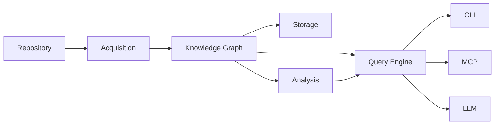
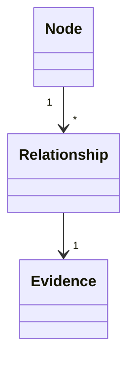
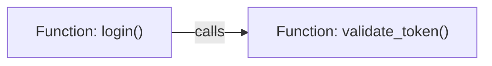
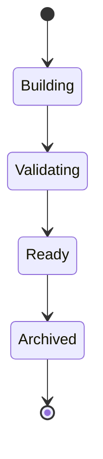
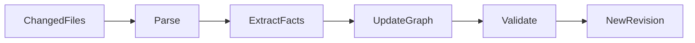

# Knowledge Graph

This document specifies the **Knowledge Graph**, the canonical representation
of repository knowledge within **kode**.

The Knowledge Graph is the central domain model of the system.

It provides a deterministic, structured, and language-independent view of a
repository that enables efficient querying, analysis, and evidence-backed
reasoning.

The Knowledge Graph is an implementation detail. Users interact with CLI,
MCP, and AI agents—not the graph directly.

---

## Terminology

See [GLOSSARY.md](GLOSSARY.md) for definitions of all core terms.

---

## Purpose

The Knowledge Graph exists to answer one question efficiently:

> Given a repository, how can its structure and relationships be represented in
> a deterministic form?

Rather than repeatedly traversing the filesystem or reparsing source code,
kode constructs a reusable graph that captures repository entities and their
relationships.

The graph is designed to be:

* deterministic
* immutable
* incrementally updateable
* language independent
* evidence-backed
* queryable

---

## Position in the Architecture

The Knowledge Graph sits at the center of the architecture.



Everything before the graph discovers facts.

Everything after the graph consumes facts.

---

## Responsibilities

The Knowledge Graph is responsible for:

- representing repository entities
- representing deterministic relationships
- preserving evidence
- exposing graph traversal APIs
- supporting graph queries (low-level traversal)
- remaining language independent

The graph is **not** responsible for:

- filesystem traversal
- parsing source code
- persistence
- AI reasoning
- report generation
- visualization

Those responsibilities belong to other subsystems.

---

## Core Concepts

The graph consists of three fundamental concepts.

* Nodes
* Relationships
* Evidence



Everything in the graph ultimately reduces to these concepts.

---

## Nodes

A node represents an entity within the repository.

Nodes describe **things**, not actions.

Examples include:

* Repository
* Workspace
* Package
* Directory
* File
* Module
* Function
* Method
* Struct
* Enum
* Trait
* Interface
* Class
* Variable
* Constant
* Macro
* Manifest
* Configuration file
* Test

Every node has a unique identity.

---

## Node Identity

Every node is assigned a stable identifier.

The identifier exists independently of presentation.

Stable identities allow:

* incremental updates
* efficient caching
* graph diffing
* external references

Node identifiers should remain stable whenever repository changes permit.

---

## Node Metadata

Each node carries metadata appropriate for its kind.

Common metadata includes:

* identifier
* node kind
* language
* qualified name
* display name
* source file
* source span
* visibility
* attributes

Individual node types may expose additional metadata.

For example, a function node may include parameters and return type, while a
manifest node may include package metadata.

---

## Relationships

Relationships connect nodes.

Every relationship has:

* source node
* destination node
* relationship type
* evidence

Relationships are directed.



Relationships represent deterministic facts extracted from the repository.

---

## Relationship Types

The graph distinguishes between relationship semantics.

Examples include:

* contains
* defines
* declares
* imports
* exports
* references
* calls
* implements
* inherits
* depends_on
* tests
* documents

Relationship meanings never overlap.

Each relationship type has a single semantic interpretation.

---

## Evidence

Evidence is a first-class concept.

Every node and every relationship must be backed by repository evidence.

Examples include:

* source locations
* manifest entries
* configuration files

Typical evidence:

```text
src/auth/login.rs:42
```

Evidence is never inferred by an LLM.

If evidence cannot be established, the graph element must not exist.

---

## Graph Construction

Graph construction follows a deterministic sequence.

```mermaid
flowchart LR

Repository

--> Parsing

--> Fact Extraction

--> Normalization

--> Graph Construction

--> Validation

--> Knowledge Graph
```

Each stage has a single responsibility.

Graph construction never performs interpretation.

---

## Graph Validation

Before becoming available, every graph is validated.

Validation includes:

* duplicate detection
* orphan detection
* invalid relationships
* missing metadata
* malformed evidence
* structural consistency

Invalid graphs are rejected.

---

## Lifecycle

### Graph Lifecycle

The graph is immutable after construction.



Repository changes never mutate an existing graph.

Instead, a new graph revision is produced.

This guarantees deterministic behavior and thread safety.

---

## Graph Queries

Consumers interact with the graph through a query API.

Low-level operations include:

* locate node by identifier
* locate node by name
* enumerate relationships for a node
* traverse inbound relationships
* traverse outbound relationships
* filter by node type

Higher-level query operations (intent resolution, context assembly) belong to the Query Engine.

Consumers never manipulate graph internals directly.

---

## Graph Traversal

Traversal replaces repeated filesystem searches.

The graph narrows the search space.

Source files remain the final authority.

---

## Graph Algorithms

The graph supports low-level traversal primitives used by the Analysis and Query Engine subsystems.

Higher-level algorithms (dependency analysis, cycle detection, metrics) belong to the Analysis layer.

Algorithms never modify graph state.

---

## Incremental Updates

Repository changes should not require rebuilding the entire graph.



Only affected entities are recomputed.

Unchanged regions are preserved.

---

## Serialization

The graph is independent of persistence.

Possible serialization formats include:

* SQLite
* JSON
* GraphML
* DOT

Serialization is an adapter.

It is never the canonical representation.

---

## Extension Points

The graph is intentionally extensible.

Future node types may include:

* Git commits
* Code ownership
* Runtime traces
* Test coverage
* Security findings
* Performance profiles

Future relationship types may include:

* owns
* generated_by
* executes
* observes
* deploys

The graph model is expected to evolve without requiring architectural
changes.

---

## Design Constraints

Every implementation of the Knowledge Graph must satisfy the architectural invariants defined in [DESIGN.md](../DESIGN.md#architectural-invariants). In addition:

- Immutable after construction
- Serializable to multiple formats
- Language independent
- Extensible (node types, relationship types)

Any implementation that violates these constraints is considered incorrect.

---

## See Also

- [DESIGN.md](../DESIGN.md) — System design and invariants
- [Documentation index](README.md) — All documents

