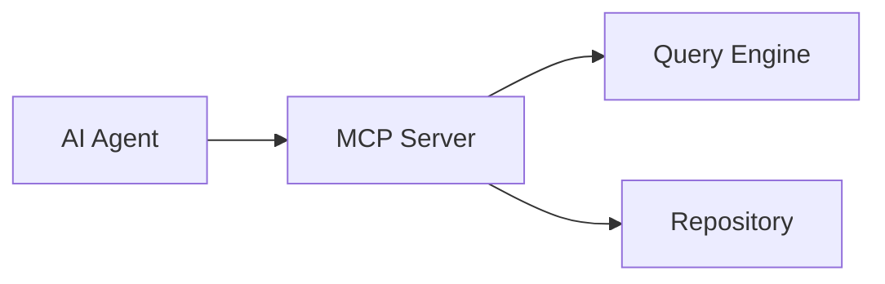
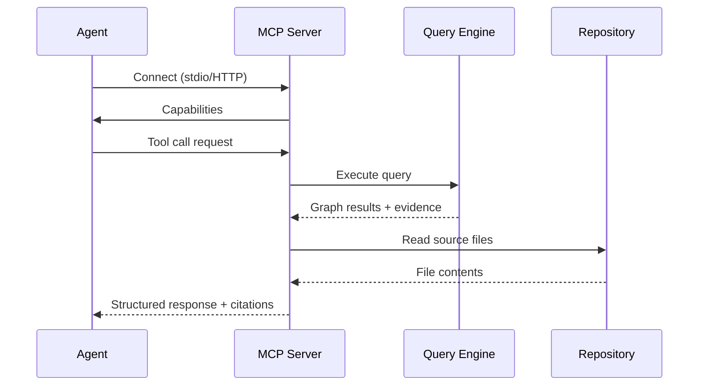

# MCP

> **Implementation status:** The MCP server is implemented. Module at `tools/cli/src/mcp.rs` exposes 8 tools (`find_symbol`, `search_symbols`, `get_symbol_details`, `symbols_by_kind`, `read_file`, `find_callers`, `find_callees`, `impact_analysis`) over stdio or HTTP transport via `rmcp`.

This document describes the **MCP (Model Context Protocol)** integration in **kode**.

MCP is a protocol that allows AI agents to interact with tools and data sources. The kode MCP server exposes repository understanding to any MCP-compatible AI agent.

---

## Purpose

The MCP server exists to make repository knowledge available to AI agents through a standardized protocol. Agents can query the repository, retrieve evidence, and receive structured answers — all grounded in live source code.

The MCP server is an interface. It consumes existing repository knowledge. It never builds repository understanding.

---

## Position in the Architecture

The MCP server sits between AI agents and the rest of kode. It delegates all repository operations to the Query Engine and the live repository.

---

## Responsibilities

The MCP server is responsible for:

- accepting MCP connections from AI agents
- exposing repository tools
- executing tool calls against the Query Engine
- reading repository files for evidence
- returning structured results with citations

The MCP server is **not** responsible for:

- parsing source code
- building the Knowledge Graph
- running analysis
- maintaining state between requests

---

## Request Lifecycle

---

## Transport

The MCP server supports multiple transports:

- **stdio** — for local agent integration
- **HTTP** (SSE) — for remote agent access

Transport selection is a deployment concern. It does not affect behavior.

---

## Session Model

Each MCP session is independent. The server maintains no per-session state beyond the connection itself.

Every request is fully authenticated and authorized against the repository. Sessions are ephemeral — no session data persists across restarts.

---

## Tool Execution

The MCP server exposes repository tools to agents. Examples include:

- find symbol
- get symbol details
- find callers
- find callees
- find references
- find implementations
- read file
- search project

Each tool returns results with `path:line` citations. Tools never accept or return AI-generated repository knowledge.

---

## Repository Access

The MCP server can access the repository for:

- reading source files (via evidence references)
- navigating directory structure
- searching file contents

All repository access is read-only. The MCP server never modifies the repository.

---

## Evidence Handling

Every tool response preserves evidence. Evidence is:

- always sourced from the repository
- never fabricated by the agent or server
- formatted as `path:line` citations
- verifiable by inspecting the repository

The MCP server enforces the evidence contract. Responses without evidence are not produced.

---

## Stateless Behavior

The MCP server is stateless between requests. There is no:

- conversation history
- cached agent state
- session-specific repository view

Each request operates on the current repository state. This guarantees that every answer reflects the latest repository content.

---

## Extension Points

The MCP server supports extension through:

- new tools
- new transport adapters
- new authentication mechanisms
- custom tool permissions

---

## Design Constraints

Every MCP implementation must satisfy:

- read-only repository access
- evidence preservation in all responses
- stateless request handling
- delegation to Query Engine (no direct graph manipulation)
- no repository knowledge creation

These constraints are architectural invariants. The MCP server is a consumer — it never creates.

---

## See Also

- [DESIGN.md](../DESIGN.md) — System design
- [Documentation index](README.md) — All documents
