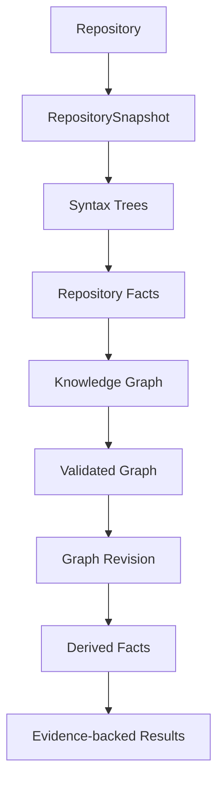
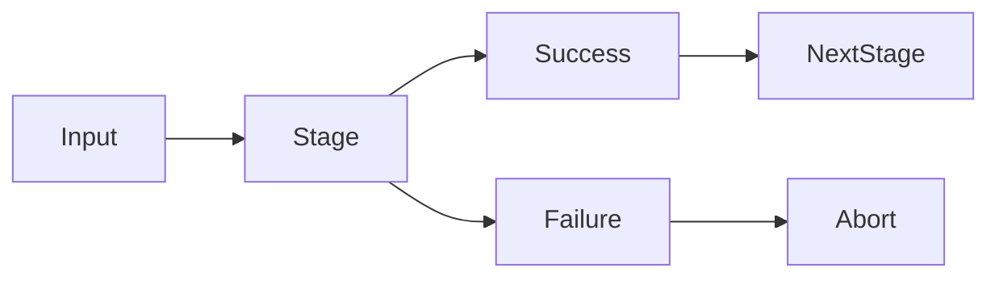

# Repository Processing Pipeline

This document describes how **kode** transforms a software repository into
structured, deterministic, and queryable knowledge.

The pipeline is the backbone of repository understanding.

Given the same repository contents, the pipeline will always produce the
same Knowledge Graph and the same Repository Facts.

Repository understanding is therefore reproducible, incremental, and
independent of AI models.

---

## Purpose

The repository processing pipeline exists to transform raw source code into
structured repository knowledge that can be efficiently queried, analyzed,
and consumed by humans and AI agents.

The pipeline provides:

- deterministic repository analysis
- language-independent processing
- incremental execution
- evidence preservation
- reproducible outputs

Every stage has a single responsibility.

Every stage produces an immutable artifact consumed by the next stage.

---

> **Implementation status:** Stage 1 (Repository Discovery), Stage 2 (Parsing), Stage 3 (Fact Extraction), Stage 4 (Graph Construction + Validation), and Stage 5 (Persistence) are implemented. Stages 6–8 document the architectural design and are planned as future work.

## Design Principles

The pipeline follows the architectural principles defined in [DESIGN.md](../DESIGN.md#architecture-principles): deterministic, incremental, evidence-first, immutable artifacts, and separation of concerns.

These principles are documented fully in DESIGN.md.

---

## Processing Lifecycle

Repository understanding follows a deterministic sequence.

Each stage transforms one artifact into another.

Earlier stages discover facts.

Later stages organize, analyze, and present those facts.

---

## Pipeline Summary

| Stage | Input | Output | Owner | Status |
|---------|--------|---------|---------|--------|
| Repository Discovery | Repository | RepositorySnapshot | Acquisition | ✓ Implemented |
| Parsing | RepositorySnapshot + SourceInventory | Syntax Trees | Analysis | ✓ Implemented |
| Fact Extraction | Syntax Trees | Repository Facts | Analysis | ✓ Implemented |
| Graph Construction | Repository Facts | Knowledge Graph | Graph | ✓ Implemented |
| Graph Validation | Knowledge Graph | Validated Graph | Graph | ✓ Implemented |
| Persistence | Validated Graph | Graph Revision | Storage | ✓ Implemented |
| Analysis | Graph Revision | Derived Facts | Analysis | Planned |
| Query Execution | Graph Revision + Repository | Evidence-backed Results | Query Engine | Planned |

Each stage owns exactly one transformation.

No stage bypasses another.

---

## Pipeline Artifacts

The pipeline progressively transforms repository information into higher
levels of abstraction.

Each artifact is immutable.

Each artifact has a single producer.

Each artifact may have many consumers.

---

## Stage 1 — Repository Discovery

See [ACQUISITION.md](ACQUISITION.md) for the Acquisition subsystem specification.

### Purpose

Discover the repository and produce a deterministic snapshot of its
structure.

This stage establishes the processing boundary for every later stage.

No source code is parsed.

No repository knowledge is inferred.

---

### Input

Repository.

---

### Output

RepositorySnapshot.

---

### Orchestration

Repository Discovery is an orchestration layer, not a monolithic algorithm.
It coordinates five internal steps:

1. **Workspace detection** — identify workspace structure via registered workspace detectors
2. **Filesystem traversal** — enumerate files and directories respecting `.gitignore`
3. **Manifest discovery** — locate build configuration and package manifests
4. **Language detection** — classify files by programming language
5. **Snapshot construction** — assemble all inventories into an immutable RepositorySnapshot

Each step delegates to a registry of detectors. See [Detector Architecture](ACQUISITION.md#detector-architecture) and [Registries](ACQUISITION.md#registries) in ACQUISITION.md.

---

### Responsibilities

Repository Discovery is responsible for:

- orchestrating workspace detection
- enumerating repository files
- respecting `.gitignore`
- identifying supported languages
- locating manifests
- constructing an immutable snapshot

---

### Produced Artifact

RepositorySnapshot.

Contents include:

- repository root
- workspace structure
- directory inventory
- file inventory
- manifest inventory
- language inventory

---

### Invariants

This stage must satisfy the following constraints.

- deterministic
- read-only
- filesystem only
- no parsing
- no graph construction
- no repository interpretation

---

### Failure Modes

Repository discovery may fail when:

- the repository cannot be located
- filesystem permissions prevent traversal
- the workspace layout is invalid
- manifests cannot be resolved

Failure terminates the pipeline.

Partial RepositorySnapshots are never emitted.

---

## Stage 2 — Parsing (Implemented)

The Parsing subsystem lives in the `kode-analysis` crate within the `parsing` module. See [ANALYSIS.md](ANALYSIS.md) for the full specification.

### Purpose

Transform repository source files into language-specific syntax trees.

Parsing extracts syntax without interpreting repository semantics.

The parser understands language grammar.

It does not understand architecture.

---

### Implementation

Parsing is implemented as a pure transformation pipeline:

1. **ParserRegistry** — ordered collection of language-specific parsers with language-keyed dispatch
2. **ParsingOrchestrator** — iterates files from `RepositorySnapshot`, looks up source text in `SourceInventory`, dispatches to parsers
3. **RustParser** — Tree-sitter-backed parser for Rust source files (initial implementation)
4. **SourceInventory** — immutable source text storage, loaded before parsing begins

The pipeline reads file content **before** parsing begins, constructing a `SourceInventory`. Parsing itself performs no filesystem I/O — it is a pure transformation over immutable inputs.

---

### Input

RepositorySnapshot + SourceInventory.

---

### Output

SyntaxTreeInventory.

Each entry in the inventory is a `FileParseOutcome` that discriminates between:

- **Success** — clean parse, tree is available
- **Recovered** — tree produced with syntax errors, still usable
- **Skipped** — language has no registered parser
- **Failed** — parse error, no tree produced

---

### Responsibilities

Parsing is responsible for:

- selecting the correct parser via `ParserRegistry::dispatch()`
- parsing source files
- reporting syntax errors as structured `Diagnostic` values
- preserving source locations
- exposing language-specific syntax

Supported parsers operate independently.

Adding a new language parser requires implementing the `Parser` trait and registering it in a `ParserRegistry`.

---

### Produced Artifact

SyntaxTreeInventory.

Each `SyntaxTree` represents one successfully parsed source file and stores:

- relative path
- language
- source text (shared via `Arc<str>`)
- diagnostics (if any)
- parser metadata (name, version, grammar version, backend identifier)
- internal syntax backend (opaque, not exposed in public API)

The inventory accounts for every file in the snapshot, including skipped and failed outcomes.

---

### Invariants

Parsing must satisfy the following constraints.

- deterministic
- language specific
- lossless
- no filesystem I/O
- no repository interpretation
- no graph construction
- no dependency analysis
- no mutation of `RepositorySnapshot` or `SourceInventory`

---

### Failure Modes

Parsing may fail due to:

- malformed source code (produces `Recovered` tree)
- unsupported language versions
- parser implementation errors

Parser failures identify the affected file without corrupting the remaining pipeline. One malformed file never aborts repository parsing.

---

## Stage 3 — Fact Extraction (Implemented)

The Fact Extraction subsystem lives in the `kode-analysis` crate within the `extraction` module. See [ANALYSIS.md](ANALYSIS.md) for the full specification.

### Purpose

Transform language-specific syntax trees into language-independent repository
facts.

Fact Extraction is the bridge between parsing and repository understanding.

At the end of this stage, all extracted information has a common
representation regardless of programming language.

No relationships are inferred.

No analysis is performed.

Only objective repository facts are produced.

---

### Input

Syntax Tree Inventory.

---

### Output

Repository Facts.

---

### Implementation

Fact Extraction is implemented as a pure transformation pipeline:

1. **ExtractorRegistry** — ordered collection of language-specific extractors with language-keyed dispatch
2. **ExtractionOrchestrator** — iterates trees from `SyntaxTreeInventory`, dispatches to extractors, merges results
3. **RustExtractor** — Tree-sitter-backed extractor for Rust source files (initial implementation)
4. **RepositoryFacts** — immutable domain artifact containing all extracted entities

The pipeline iterates parsed syntax trees and performs extraction as a pure transformation over immutable inputs. No filesystem I/O occurs during extraction.

### Responsibilities

Fact Extraction is responsible for:

- identifying repository entities
- extracting symbols
- extracting declarations
- extracting definitions
- extracting imports
- extracting exports
- preserving source locations
- attaching evidence
- producing stable entity identifiers

The extractor normalizes language-specific constructs into a common model.

---

### Produced Artifact

Repository Facts.

Currently extracted entities include:

- modules
- functions (top-level and methods)
- structs (with fields)
- enums (with variants)
- traits (with methods, associated types, associated constants)
- impl blocks (with methods, target type, implemented trait)
- type aliases
- constants
- statics
- imports

Every entity carries:
- A stable `EntityId` (deterministic hash-based identifier)
- `Evidence` (source file, node kind, byte range, line/column, language)

Repository Facts remain language independent.

---

### Invariants

Fact Extraction must satisfy the following constraints.

- deterministic
- language independent
- evidence preserving
- no graph construction
- no dependency analysis
- no interpretation

---

### Failure Modes

Fact Extraction may fail when:

- parser output is invalid
- mandatory metadata is missing
- unsupported syntax is encountered

Extraction failures produce diagnostics but do not abort processing for unaffected trees.

---

## Stage 4 — Graph Construction & Validation (Implemented)

Stage 4 lives in the `kode-graph` crate at `crates/graph/`.

### Purpose

Transform repository facts into the canonical Knowledge Graph.

Graph Construction organizes isolated facts into a connected repository
representation.

Every repository entity becomes a node.

Every deterministic relationship becomes an edge.

---

### Input

Repository Facts (from Stage 3).

---

### Output

Validated Knowledge Graph.

---

### Implementation

Graph construction and validation are combined in a single pipeline within the
`kode-graph` crate.

**GraphBuilder** decomposes construction into focused sub-modules:

| Module | Responsibility |
|---------|---------------|
| `builder/mod.rs` | Orchestration — coordinates the build pipeline via [`GraphBuildState`] |
| `builder/context.rs` | [`RepositoryContext`] — sole owner of temporary repository metadata derivation (external to the builder) |
| `builder/structural.rs` | Structural nodes (repository, workspace, file); returns [`StructuralLookup`] |
| `builder/node_builder.rs` | Entity nodes (one per extracted fact) |
| `builder/relationship_builder.rs` | Relationship derivation — consumes [`StructuralLookup`] |
| `builder/identity.rs` | Graph-level identity and evidence construction |
| `builder/index.rs` | Lookup and edge index structures |

### Ownership Boundaries

* [`RepositoryContext`] is constructed externally and passed to [`GraphBuilder::build`].
* Structural IDs are generated exactly once by `structural` and cached for relationship construction — no duplicate hashing.
* [`GraphBuildState`] replaces independent vectors/maps during construction.

**GraphValidator** performs all documented invariant checks:

- Structural root validation (exactly one repository, exactly one workspace)
- Evidence completeness (every node and relationship has evidence)
- Identity/evidence consistency (structural nodes use structural identity + evidence; entity nodes use entity identity + source evidence)
- Orphan relationship detection
- Duplicate node ID safety net

**KnowledgeGraph** is the immutable output:

- Nodes sorted deterministically by [`GraphNodeId`]
- O(log n) lookup by ID via `BTreeMap`
- O(1) outgoing/incoming edge traversal
- `nodes_by_kind` filtered iteration

### Identity Model

Structural graph nodes (repository, workspace, file) use
[`GraphNodeId::Structural`] with [`StructuralNodeId`], computed from
(kind, path, name) in a namespace separate from extracted entities.

Extracted entity nodes use [`GraphNodeId::Entity`] wrapping the existing
[`EntityId`].

Structural and entity identities cannot collide — they use separate hash
namespaces.

### Evidence Model

Extracted entity nodes carry [`GraphEvidence::Source`] wrapping the
original parser-produced [`Evidence`].

Structural nodes carry [`GraphEvidence::Structural`] with a human-readable
description.

No structural node fabricates parser evidence.

### Responsibilities

Graph Construction is responsible for:

- creating structural nodes (repository, workspace, file)
- creating entity nodes from extracted facts
- creating relationships (contains, declares, defines)
- assigning structural identifiers
- attaching evidence
- validating graph invariants
- preserving deterministic ordering

The graph becomes the canonical representation of repository knowledge.

---

### Produced Artifact

Knowledge Graph.

The graph contains:

- nodes (structural + entity)
- relationships
- evidence
- metadata

Every graph element originates from repository facts.

---

### Invariants

Graph Construction must satisfy:

- deterministic
- immutable
- language independent
- evidence backed
- reproducible
- structural/entity identity separation
- structural/entity evidence separation

Graph construction never performs architectural interpretation.

---

### Failure Modes

Graph Construction may fail when:

- repository facts are inconsistent
- duplicate identifiers are generated
- invalid relationships are detected
- structural roots are missing or duplicated
- evidence is missing

Invalid graphs are discarded.

---

## Stage 5 — Persistence (Implemented)

The Persistence subsystem lives in the `kode-storage` crate at `crates/storage/`.
See [STORAGE.md](STORAGE.md) for the full specification.

### Purpose

Persist the validated graph for future executions.

Persistence makes repository processing incremental.

Subsequent executions should reuse existing repository knowledge whenever
possible.

---

### Input

Validated Graph.

---

### Output

Graph Revision.

---

### Implementation

Persistence is built on a backend abstraction providing:

1. **Backend abstraction** — interface for storage operations including initialization, revision management, graph persistence, metadata caching, and schema discovery
2. **Repository-scoped storage** — binds a backend to a specific repository for scoped operations
3. **Schema versioning** — tracks schema compatibility for safe migration
4. **Revisioned persistence** — immutable versioned snapshots with content-addressed identification and metadata tracking
5. **Cache state tracking** — summary of cache state including latest revision and graph format version
6. **Deterministic serialization** — graph data is serialized via the graph crate's deterministic format, keeping the backend format-independent

### Responsibilities

Persistence is responsible for:

- storing graph nodes
- storing relationships
- storing evidence
- storing repository metadata
- creating graph revisions
- updating cache metadata

Persistence never changes repository knowledge.

It only stores it.

---

### Produced Artifact

Graph Revision.

Each revision represents one complete repository state.

Graph revisions are immutable.

---

### Invariants

Persistence must satisfy:

- transactional updates
- deterministic storage
- immutable revisions
- rollback on failure

---

### Failure Modes

Persistence may fail because of:

- storage corruption
- insufficient disk space
- transaction failures
- schema incompatibility

Failed persistence never exposes partial graph revisions.

---

## Stage 6 — Analysis (Planned)

### Purpose

Derive higher-level repository knowledge from the persisted Knowledge Graph.

Unlike previous stages, Analysis does not discover new repository facts.

Instead, it interprets existing graph relationships to answer architectural
questions and compute repository metrics.

Analysis is entirely deterministic.

---

### Input

Graph Revision.

---

### Output

Derived Facts.

---

### Responsibilities

Analysis is responsible for:

- dependency analysis
- impact analysis
- cycle detection
- reachability analysis
- architecture metrics
- graph metrics
- dead code detection
- dependency visualization
- repository summaries

Analysis never modifies the Knowledge Graph.

It is a pure consumer of graph data.

---

### Produced Artifact

Derived Facts.

Examples include:

- dependency trees
- dependency cycles
- strongly connected components
- fan-in metrics
- fan-out metrics
- architecture summaries
- repository statistics
- impact reports

Derived Facts remain evidence-backed.

Every result must remain traceable to graph elements.

---

### Invariants

Analysis must satisfy the following constraints.

- deterministic
- read-only
- reproducible
- graph preserving
- evidence preserving

Analysis must never introduce repository knowledge unsupported by the graph.

---

### Failure Modes

Analysis may fail due to:

- invalid graph revisions
- unsupported algorithms
- resource limitations

Analysis failures never invalidate the underlying graph revision.

---

## Stage 7 — Query Execution (Planned)

### Purpose

Transform repository knowledge into evidence-backed answers.

Query Execution is the boundary between repository understanding and user
interaction.

It retrieves relevant graph elements, verifies evidence against the
repository, and produces structured results for consumers.

---

### Input

- Graph Revision
- Repository
- User Query

---

### Output

Evidence-backed Results.

---

### Responsibilities

Query Execution is responsible for:

- interpreting user intent
- traversing the Knowledge Graph
- locating relevant entities
- retrieving supporting evidence
- verifying evidence against repository files
- preparing context for consumers
- attaching citations

The Query Engine does not create repository knowledge.

It retrieves existing knowledge.

---

### Produced Artifact

Evidence-backed Results.

These results may contain:

- repository entities
- graph relationships
- source locations
- supporting evidence
- repository excerpts
- derived analysis

Consumers decide how these results are presented.

---

### Invariants

Query Execution must satisfy:

- deterministic graph traversal
- repository verification
- evidence preservation
- citation attachment

Every answer must remain traceable to the repository.

---

### Failure Modes

Query execution may fail due to:

- missing entities
- insufficient evidence
- invalid queries
- repository changes during execution

When evidence cannot be established, the query should return an explicit
"unknown" result rather than speculate.

---

## Incremental Processing

Incremental execution is the default operating mode.

Rather than rebuilding the entire repository model, the pipeline processes
only affected regions.

Incremental processing minimizes unnecessary work while preserving
deterministic results.

---

## Glossary

This document references the following terms defined in [GLOSSARY.md](GLOSSARY.md):

- [RepositorySnapshot](GLOSSARY.md#repositorysnapshot)
- [Syntax Tree](GLOSSARY.md#syntax-tree)
- [SyntaxTreeInventory](GLOSSARY.md#syntaxtreeinventory)
- [Repository Fact](GLOSSARY.md#repository-fact)
- [Knowledge Graph](GLOSSARY.md#knowledge-graph)
- [Graph Revision](GLOSSARY.md#graph-revision)
- [Derived Fact](GLOSSARY.md#derived-fact)
- [Query Result](GLOSSARY.md#query-result)

---

## Pipeline Ownership

Each stage belongs to exactly one architectural subsystem.

| Pipeline Stage | Owning Subsystem | Status |
|---------------|------------------|--------|
| Repository Discovery | Acquisition (see [ACQUISITION.md](ACQUISITION.md)) | ✓ Implemented |
| Parsing | Analysis (see [ANALYSIS.md](ANALYSIS.md)) | ✓ Implemented |
| Fact Extraction | Analysis (see [ANALYSIS.md](ANALYSIS.md)) | ✓ Implemented |
| Graph Construction | Knowledge Graph | ✓ Implemented |
| Graph Validation | Knowledge Graph | ✓ Implemented |
| Persistence | Storage | ✓ Implemented |
| Analysis | Analysis | Planned |
| Query Execution | Query Engine | Planned |

Each subsystem owns one responsibility.

Ownership never overlaps.

---

## Error Handling

The pipeline is fail-fast.

A stage either:

- produces a valid artifact, or
- reports failure.

Partial artifacts are never consumed by downstream stages.

This guarantees downstream stages always operate on valid inputs.

---

## Extension Points

The pipeline is intentionally extensible.

Supported extension points include:

- **repository discovery** — workspace detectors, manifest detectors, and language detectors extend Stage 1 without modifying the orchestration layer
- **language parsers** — register new parsers with `ParserRegistry`; implement `Parser` trait for each language; parser backends encapsulated behind the trait
- manifest parsers
- fact extractors
- graph builders
- validators
- analysis algorithms
- exporters
- query providers

Extensions should integrate with existing stages rather than introducing new
processing paths.

Within Stage 1 specifically, new ecosystems are supported by implementing
detector traits and registering them with the corresponding registries:

- **WorkspaceDetector** — add support for new workspace layouts
- **ManifestDetector** — add support for new package manifest formats
- **LanguageDetector** — add support for additional programming languages

No changes to `RepositoryDiscovery` or the snapshot model are required.

---

## Pipeline Invariants

Every implementation of the repository processing pipeline must satisfy the
following constraints.

- deterministic
- incremental
- immutable artifacts
- evidence preservation
- reproducible outputs
- language independence
- fail-fast execution
- single responsibility per stage

These are architectural invariants.

No feature should violate them.

---

## Future Evolution

The pipeline is expected to grow over time.

Future processing stages may include:

- Git history analysis
- repository ownership analysis
- code generation tracking
- runtime trace integration
- test coverage ingestion
- security scanning
- performance profiling

These capabilities should extend existing artifacts rather than replacing
them.

The overall processing lifecycle remains unchanged:

The pipeline is intentionally designed so that new capabilities compose with
existing stages while preserving deterministic repository understanding.

---

## See Also

- [DESIGN.md](../DESIGN.md) — System design and invariants
- [Documentation index](README.md) — All documents
