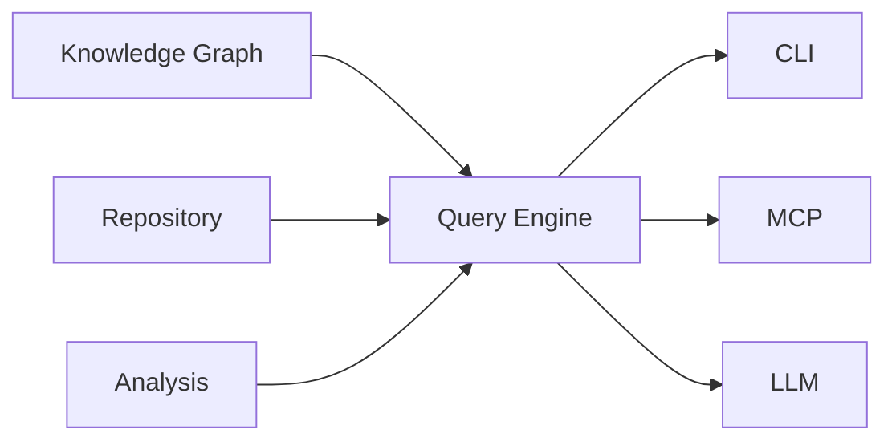
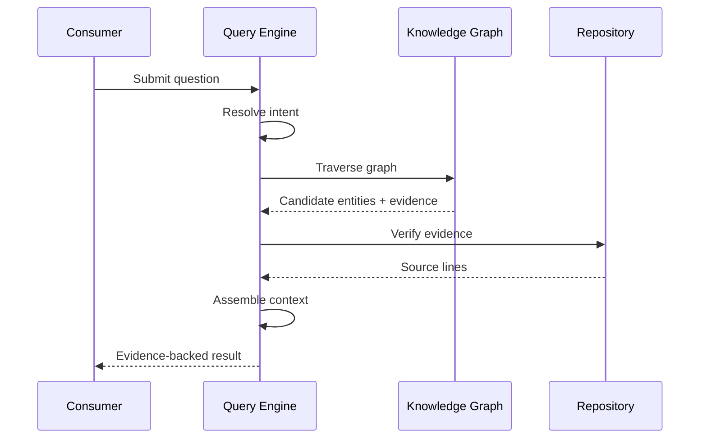

# Query Engine

This document describes the **Query Engine**, the subsystem responsible for transforming repository knowledge into evidence-backed answers.

---

## Purpose

The Query Engine exists to answer questions about the repository using the Knowledge Graph and live source files. It bridges repository understanding and user interaction — whether the consumer is a human using the CLI, an AI agent via MCP, or a future API.

The Query Engine does not create repository knowledge. It retrieves, verifies, and presents existing knowledge.

---

## Position in the Architecture

The Query Engine consumes the Knowledge Graph, Analysis results, and the live repository. It is consumed by every interface layer.

---

## Responsibilities

The Query Engine is responsible for:

- interpreting user intent
- traversing the Knowledge Graph
- locating relevant entities
- retrieving supporting evidence
- verifying evidence against repository files
- preparing context for consumers
- attaching citations

The Query Engine is **not** responsible for:

- parsing source code
- building the Knowledge Graph
- running graph algorithms (see [Analysis](ANALYSIS.md))
- persisting data (see [Storage](STORAGE.md))
- presenting results to users

---

## Core Concepts

### Intent Resolution

User questions are mapped to query types. Examples include:

- find symbol by name
- find callers of a function
- find callees of a function
- find implementations of an interface
- find references to a symbol
- traverse dependency tree
- find shortest path between two symbols

Intent resolution is deterministic — the same question always maps to the same query type.

### Graph Traversal

Once intent is resolved, the Query Engine traverses the Knowledge Graph to locate relevant nodes and relationships. Traversal uses the graph's query API (see [Knowledge Graph](KNOWLEDGE_GRAPH.md#graph-queries)).

Traversal is read-only. The graph is never modified.

### Evidence Retrieval

Graph elements carry evidence references (file paths and source locations). The Query Engine collects candidate evidence during traversal.

### Repository Verification

Before returning any result, the Query Engine reads the live repository files at the referenced locations. This verification step ensures that:

- the evidence still exists
- the evidence matches the graph's claim
- the answer is grounded in the current repository state

The graph accelerates discovery. The repository confirms correctness.

### Context Assembly

Verified evidence is assembled into a structured context for the consumer. Context includes:

- repository entities
- graph relationships
- source locations
- repository excerpts
- derived analysis (from the Analysis subsystem)

### LLM Interaction

When the consumer is an LLM, the Query Engine:

- presents assembled context to the LLM
- constrains the LLM to answer using only the provided context
- attaches citations that the LLM must not fabricate or modify

The LLM is a consumer of evidence, not a producer.

---

## Query Lifecycle

---

## Output Model

Query results follow a consistent structure:

- query type
- matched entities
- relationships
- evidence references with `path:line` citations
- repository excerpts (where applicable)
- derived analysis (optional)
- confidence (always "verified" or "unknown")

---

## Failure Handling

When a query cannot be answered:

- **Missing entity**: return empty result with "not found" status
- **Insufficient evidence**: return "unknown" rather than speculate
- **Stale graph**: trigger reanalysis and retry
- **Invalid query**: return error with explanation

---

## Extension Points

The Query Engine supports extension through:

- new query types (additional intent patterns)
- new graph traversal strategies
- new context assembly modes
- new consumer adapters

---

## Design Constraints

Every Query Engine implementation must satisfy:

- deterministic graph traversal
- repository verification before answering
- evidence preservation in all results
- citation attachment on all claims
- read-only access to the Knowledge Graph

These constraints are architectural invariants. No feature should violate them.

---

## See Also

- [DESIGN.md](../DESIGN.md) — System design
- [Documentation index](README.md) — All documents
