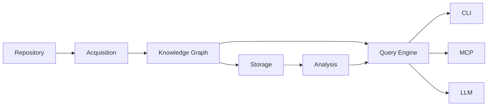

# Storage

This document describes how **kode** persists repository knowledge.

The storage layer is responsible for efficiently storing, retrieving, and
updating repository information without reparsing the repository on every
execution.

Storage is an implementation detail.

It exists to make repository analysis incremental, deterministic, and fast.

The storage layer does **not** define repository knowledge.

It persists the Knowledge Graph and related metadata.

---

## Implementation Status

The storage layer is fully implemented in the `kode-storage` crate
(`crates/storage/`). It provides a `StorageBackend` abstraction with a
default SQLite implementation, repository-scoped storage services, revision
tracking, and cache metadata.

Graph serialization is delegated to the graph crate's serialization adapter.

---

## Terminology

See [GLOSSARY.md](GLOSSARY.md) for definitions of all core terms.

---

## Position in the Architecture



Storage is positioned after graph construction.

It never parses repositories directly.

---

## Responsibilities

The storage layer is responsible for:

- graph persistence
- graph revision tracking
- cache metadata management
- schema versioning
- efficient retrieval

The storage layer is **not** responsible for:

- repository discovery
- parsing
- graph construction
- graph algorithms
- AI interaction

---

## Architecture

### Backend Abstraction

The storage layer defines a backend contract that all implementations must
satisfy. The contract covers:

- schema initialization and version checking
- atomic revision persistence
- graph loading by revision
- revision listing and metadata retrieval
- repository data removal

Backends are format-independent. Graph serialization is delegated to the
graph crate's serialization adapter — backends receive pre-serialized data
and return data to be deserialized.

### Revision Model

Every successful persistence operation produces a new revision:

| Graph Revision  |
|-----------------|
| Repository      |
| Version         |
| Timestamp       |
| Content Hash    |
| Node Count      |
| Relationship Count |

Revisions are immutable. Repository changes produce new revisions rather
than mutating existing ones. This guarantees deterministic behavior and
thread safety.

### Serialization

The storage layer does not define its own graph serialization format. It
delegates to the graph crate's serialization adapter:

```
KnowledgeGraph → serialization adapter → storage backend
```

On retrieval the flow reverses:

```
storage backend → serialization adapter → KnowledgeGraph
```

This separation keeps the storage backend format-independent and the graph
model free of persistence concerns. Changing the serialization format
requires no changes to storage backends, and vice versa.

---

## Current Implementation

The following sections describe the current implementation. This content
is documentation of the existing codebase — it is not an architectural
specification and will change as the implementation evolves.

### SQLite Backend

The default backend uses SQLite. The schema stores:

- application schema version
- repository identity and fingerprint
- revision metadata with content hash and timestamps
- serialized graph data
- cache state summary

Persistence is atomic: a single transaction serializes the graph, persists
it, and returns a revision with a content hash. On failure, the transaction
is rolled back — no partial state is visible.

### Schema Versioning

The storage schema carries a major/minor version number. Backward-incompatible
changes increment the major version; additive changes increment the minor
version. The version is checked on every initialization.

### Transactional Guarantees

All persistence operations are atomic:

- Graph serialization and all writes occur within a single transaction.
- On failure, the transaction rolls back entirely.
- Concurrent readers never observe partial state.
- Partial revisions are never exposed.

### Deterministic Persistence

Content hashing ensures:

- Identical graphs produce identical storage artifacts.
- Revision identities are deterministic given the same graph content.
- Cache invalidation is reliable.

---

## Future Evolution

SQLite is the default implementation. The `StorageBackend` trait is
designed for alternative backends:

- PostgreSQL
- RocksDB
- LMDB
- DuckDB
- in-memory storage

Alternative backends must preserve the same logical behavior.

---

## Design Constraints

Every storage implementation must satisfy the following constraints.

- Local-first
- Deterministic
- Transactional
- Incremental
- Versioned
- Backend-independent
- Graph-preserving
- Recoverable

These constraints are architectural invariants.

---

## See Also

- [KNOWLEDGE_GRAPH.md](KNOWLEDGE_GRAPH.md) — Graph model and serialization
- [DESIGN.md](../DESIGN.md) — System design and invariants
- [PIPELINE.md](PIPELINE.md) — Pipeline stage details
- [Documentation index](README.md) — All documents
