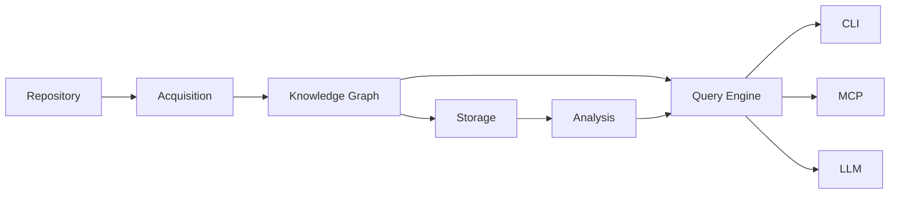
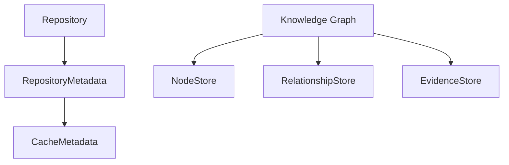
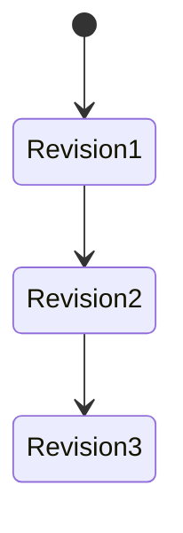
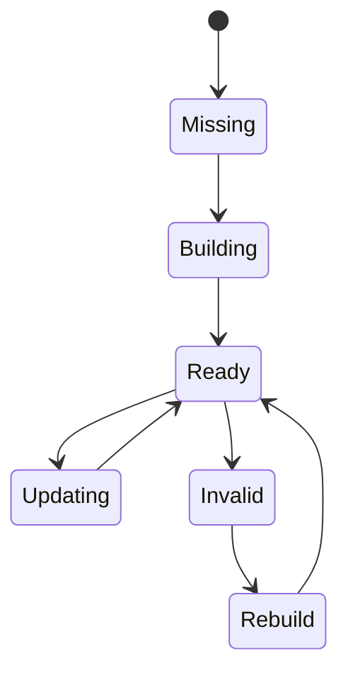

# Storage

This document describes how **kode** persists repository knowledge.

The storage layer is responsible for efficiently storing, retrieving, and
updating repository information without reparsing the repository on every
execution.

Storage is an implementation detail.

It exists to make repository analysis incremental, deterministic, and fast.

The storage layer does **not** define repository knowledge.

It persists the Knowledge Graph and related metadata.

---

## Terminology

See [GLOSSARY.md](GLOSSARY.md) for definitions of all core terms.

---

## Purpose

The storage layer has four primary responsibilities:

* persist repository knowledge
* support incremental updates
* provide efficient query access
* preserve graph revisions

Storage should never influence repository understanding.

The repository remains the source of truth.

The Knowledge Graph remains the canonical domain model.

---

## Position in the Architecture



Storage is positioned after graph construction.

It never parses repositories directly.

---

## Responsibilities

The storage layer is responsible for:

* repository cache
* graph persistence
* metadata persistence
* incremental updates
* graph revisions
* efficient retrieval

The storage layer is **not** responsible for:

* repository discovery
* parsing
* graph construction
* graph algorithms
* AI interaction

---

## Design Principles

The storage layer follows the architectural principles defined in [DESIGN.md](../DESIGN.md#architecture-principles). See those principles for the canonical definitions.

---

## Storage Model

Conceptually, storage consists of several logical datasets.



The exact physical schema is an implementation detail.

The logical responsibilities remain stable.

---

## Repository Metadata

Repository metadata identifies the repository and cache.

Examples include:

* repository identifier
* root path
* repository hash
* default branch
* cache version
* schema version

This information determines cache validity.

---

## Node Storage

Every graph node is persisted.

Typical information includes:

* node identifier
* node type
* qualified name
* language
* metadata
* source location

Node storage should support efficient lookup by:

* identifier
* type
* name
* source file

---

## Relationship Storage

Relationships are stored independently from nodes.

Typical attributes include:

* source node
* destination node
* relationship type
* evidence reference

Relationships should support efficient traversal in both directions.

Examples:

* callers
* callees
* imports
* dependents

---

## Evidence Storage

Evidence is stored separately.

Typical evidence includes:

* file path
* line range
* column range
* parser source

Separating evidence avoids duplication across relationships.

---

## Cache Metadata

The cache tracks repository state.

Typical metadata includes:

* schema version
* graph version
* parser versions
* repository fingerprint
* last update

Cache metadata determines whether incremental processing is possible.

---

## Repository Identity

Each repository has a stable identity.

Conceptually:

```text
Repository

↓

Fingerprint

↓

Cache Directory

↓

Persistent Storage
```

The repository identity should remain stable across executions.

Moving the repository should not unnecessarily invalidate the cache when
identity can be preserved.

---

## Incremental Updates

Incremental processing is the primary design goal.


Only affected graph elements should be rewritten.

Unchanged entities remain untouched.

---

## Change Detection

Before parsing begins, the storage layer determines what changed.

Possible mechanisms include:

* content hash
* modification time
* file size
* repository metadata

Hash-based validation should be preferred whenever practical.

---

## Graph Revisions

Every successful update produces a new graph revision.



Consumers should always observe a consistent graph revision.

Partial updates must never become visible.

---

## Transactions

Updates should be transactional.


Failures should roll back completely.

The storage layer should never expose partially updated repository state.

---

## Cache Lifecycle



Cache state transitions should be deterministic.

---

## Serialization

The storage layer defines how graph data is persisted.

Possible serialization targets include:

* SQLite
* JSON
* GraphML
* Binary snapshots

Serialization formats may evolve independently of the graph model.

---

## Performance Goals

The storage layer should optimize for:

* fast startup
* fast incremental updates
* efficient graph traversal
* low memory usage
* minimal disk writes

Read performance is generally more important than write performance.

---

## Failure Recovery

Storage failures should never corrupt repository knowledge.

Recovery strategies include:

* transaction rollback
* cache invalidation
* graph rebuild
* schema migration

If recovery is impossible, the cache should be discarded and rebuilt from
the repository.

---

## Schema Evolution

Storage schemas will evolve.

Schema changes should:

* preserve compatibility where practical
* support automatic migration
* invalidate incompatible caches
* never compromise correctness

Schema versioning is independent of application versioning.

---

## Future Storage Backends

SQLite is the default implementation.

Future storage backends may include:

* PostgreSQL
* RocksDB
* LMDB
* DuckDB
* in-memory storage

Alternative backends must preserve the same logical behavior.

The storage interface should remain backend-independent.

---

## Design Constraints

Every storage implementation must satisfy the following constraints.

* Local-first
* Deterministic
* Transactional
* Incremental
* Versioned
* Backend-independent
* Graph-preserving
* Recoverable

These constraints are architectural invariants.

Storage exists to persist repository knowledge efficiently.

It must never become the source of repository knowledge.

---

## See Also

- [DESIGN.md](../DESIGN.md) — System design and invariants
- [Documentation index](README.md) — All documents

